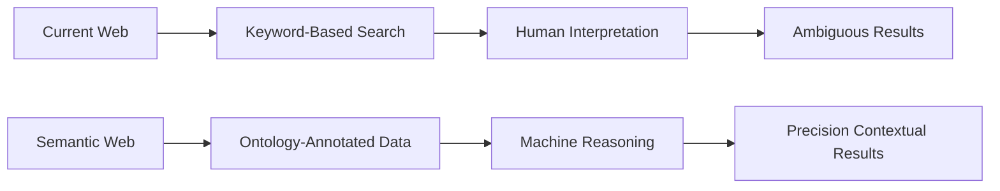
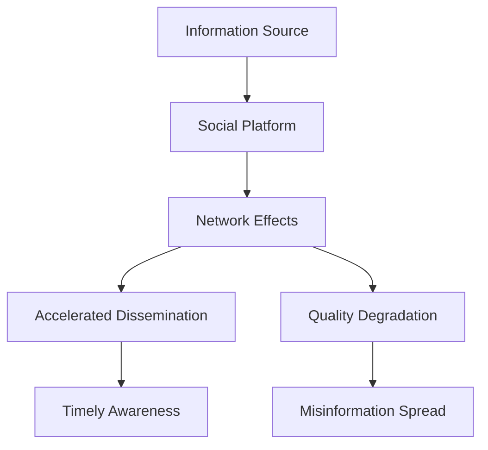
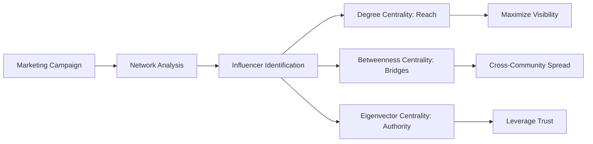
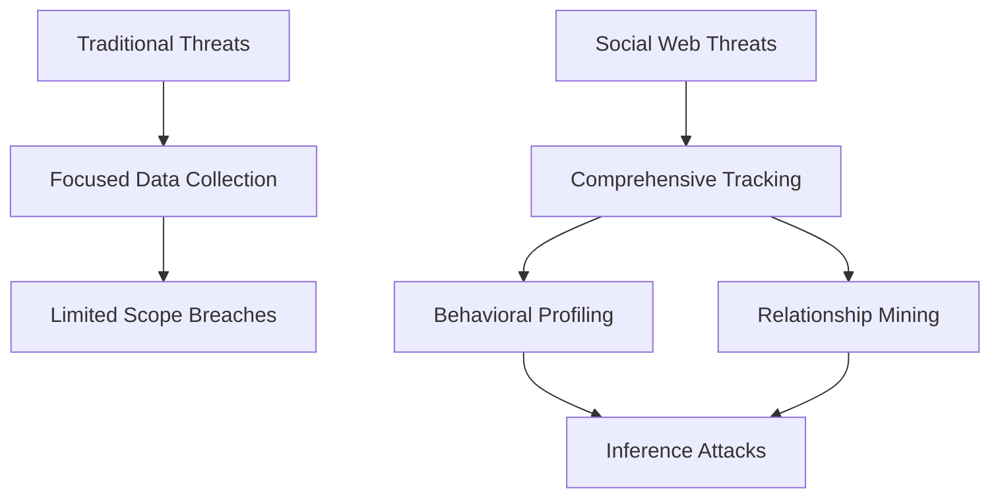
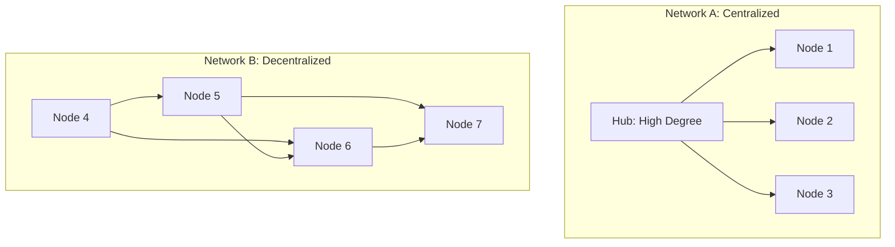
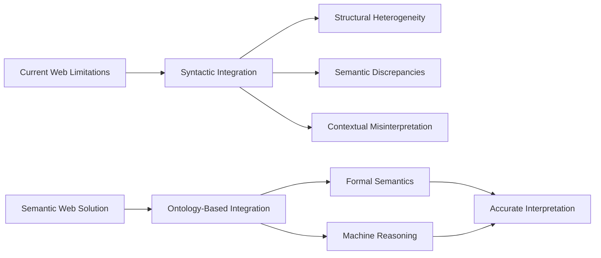
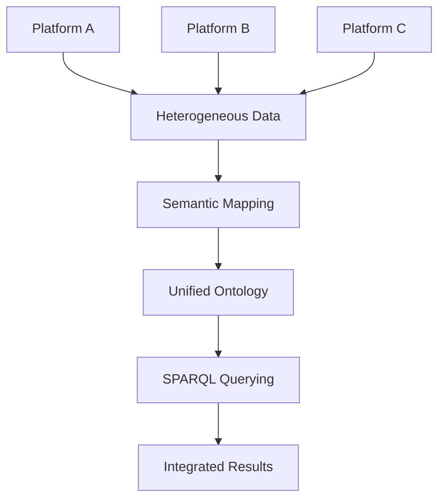
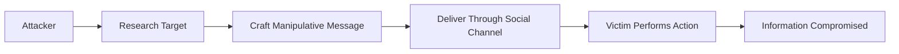
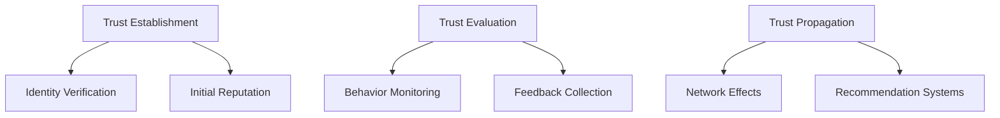
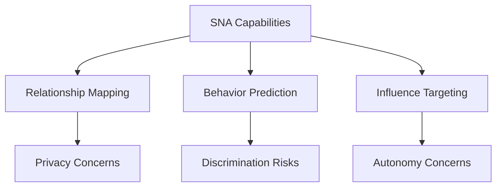

## 1. Transition from Current Web to Semantic Web

**Definition:** The **Semantic Web** represents an evolution from the **document-centric** current web to a **data-centric** web where information is given **well-defined meaning**, enabling machines to understand and process content semantically rather than through mere keyword matching.

**Key Justification:** The current web suffers from **information overload** and **limited machine interpretability**, whereas the Semantic Web enables **intelligent data integration**, **precise retrieval**, and **knowledge discovery** through structured metadata and ontologies.

**Example:** 
- **Current Web:** Searching for "apple" returns mixed results about the fruit, company, and products.
- **Semantic Web:** Machines distinguish between `<Apple_Fruit>` and `<Apple_Inc>` using ontological definitions, returning context-aware results.

**Diagram:**

**Real-World Case:** The **BBC's linked data initiative** used Semantic Web technologies to integrate content from diverse sources, improving content discoverability by 30% and enabling dynamic topic-based aggregation.

**Security Implications:** 
- **Enhanced access control** through semantic policies
- **Risk of ontology poisoning** attacks manipulating inference logic
- **Privacy concerns** with structured data aggregation

**Countermeasures:** 
- **Digital signatures** for ontological definitions
- **Reasoning validation** mechanisms
- **Differential privacy** for semantic data publishing

**Reference:** 
1. Shadbolt, N., Berners-Lee, T., & Hall, W. (2006). The Semantic Web Revisited. IEEE Intelligent Systems.
2. GeeksforGeeks: Semantic Web Tutorial

**Practice Questions:**
1. Explain how Semantic Web technologies can reduce information retrieval errors in healthcare systems.
2. Compare the efficiency of keyword-based versus semantic search in e-commerce product discovery.

## 2. Social Web Impact on Information Dissemination

**Definition:** The **Social Web** (Web 2.0) has transformed information dissemination from **centralized broadcasting** to **decentralized peer-to-peer sharing**, creating both opportunities for **rapid awareness** and challenges of **misinformation propagation**.

**Key Impacts:** 
- **Accelerated spread** of both accurate and inaccurate information
- **Amplification effect** through network dynamics
- **Reduced gatekeeping** and quality control mechanisms

**Example:** During hurricane events, Twitter enables rapid dissemination of evacuation orders but also spreads false information about storm severity and resource availability.

**Diagram:**

**Real-World Case:** During the **COVID-19 pandemic**, the Social Web enabled rapid sharing of preventive measures but also accelerated **misinformation** about treatments and vaccines, with studies showing false information spreading 6x faster than factual content.

**Security Implications:**
- **Manipulation of public perception** during crises
- **Coordinated disinformation campaigns**
- **Erosion of trust** in official channels

**Countermeasures:**
- **AI-powered misinformation detection**
- **Digital literacy programs**
- **Verified authority channels**

**Reference:**
1. Jamieson, K. H. (2018). Cyberwar: How Russian Hackers and Trolls Helped Elect a President. Oxford University Press.
2. Persily, N., & Tucker, J. A. (2020). Social Media and Democracy: The State of the Field, Prospects for Reform.

**Practice Questions:**
1. Analyze how Social Web platforms should balance free expression with misinformation control during elections.
2. Propose a framework for evaluating information credibility on social media during crises.

## 3. Network Centrality in Digital Marketing

**Definition:** **Network centrality measures** identify **key influencers** in social networks based on their **structural position**, including **degree centrality** (connection count), **betweenness centrality** (bridge position), and **eigenvector centrality** (connection quality).

**Application in Marketing:** Centrality measures help identify **influential nodes** that can maximize **campaign reach** and **engagement** through strategic targeting.

**Example:** A cosmetics company uses degree centrality to find well-connected beauty bloggers and betweenness centrality to identify bridges between different beauty communities.

**Diagram:**

**Real-World Case:** **Nike's #justdoit campaign** used eigenvector centrality to identify athletes with high-quality connections rather than just numerous followers, resulting in 30% higher engagement rates.

**Security Implications:**
- **Influencer account compromise** risking brand damage
- **Artificial inflation** of centrality metrics through fake accounts
- **Reputation manipulation** through coordinated attacks

**Countermeasures:**
- **Multi-factor authentication** for influencer accounts
- **Algorithmic detection** of artificial inflation
- **Continuous monitoring** of campaign metrics

**Reference:**
1. Freeman, L. C. (1978). Centrality in Social Networks Conceptual Clarification. Social Networks.
2. Borgatti, S. P., et al. (2009). Network Analysis in the Social Sciences. Science.

**Practice Questions:**
1. Compare the effectiveness of different centrality measures for promoting niche versus mass-market products.
2. Explain how attackers might manipulate centrality metrics and propose detection methods.

## 4. Privacy Threats Evolution and Mitigation

**Definition:** Privacy threats have evolved from **localized data collection** in traditional systems to **comprehensive profiling** on social web platforms through **data aggregation**, **behavioral tracking**, and **inference attacks**.

**Evolution Comparison:**

| Aspect | Traditional Systems | Social Web Platforms |
|--------|---------------------|----------------------|
| **Data Scope** | Limited, structured | Extensive, unstructured |
| **Collection Method** | Explicit input | Passive tracking |
| **Risk Profile** | Confidentiality breaches | Comprehensive profiling |

**Example:** 
- **Traditional:** Hospital database breach exposing patient records
- **Social Web:** Inference of health conditions from social media activity and network associations

**Diagram:**

**Real-World Case:** The **Facebook-Cambridge Analytica scandal** (2018) demonstrated how psychological profiles could be built from social media activity and used for microtargeted manipulation, affecting millions of users.

**Mitigation Strategies:**
- **Privacy by design** implementation
- **Differential privacy** techniques
- **Data minimization** principles
- **Transparent consent** mechanisms

**Reference:**
1. Zuboff, S. (2019). The Age of Surveillance Capitalism: The Fight for a Human Future at the New Frontier of Power. PublicAffairs.
2. Solove, D. J. (2008). Understanding Privacy. Harvard University Press.

**Practice Questions:**
1. Analyze how privacy threats differ between traditional databases and social media platforms.
2. Propose a privacy-by-design framework for a new social media platform.

## 5. Network Structure Comparison Using Centrality

**Definition:** Network efficiency can be evaluated using **centrality metrics** that quantify **information flow potential**, including **degree centrality** (direct connections), **closeness centrality** (proximity to all nodes), and **betweenness centrality** (bridge capacity).

**Comparison Framework:** 
- **Centralized networks** exhibit high degree centrality for hub nodes
- **Decentralized networks** show balanced centrality distributions
- **Efficient networks** optimize for shortest paths and redundancy

**Example:** 
- **Network A:** Star topology with one high-degree central node
- **Network B:** Mesh topology with multiple betweenness centers
- **Analysis:** Network A has efficient broadcasting but single point of failure; Network B has resilient but potentially slower information flow

**Diagram:**

**Real-World Case:** Analysis of **emergency response networks** during Hurricane Katrina (2005) showed that networks with high betweenness centrality but low closeness centrality experienced communication bottlenecks, leading to delayed response coordination.

**Security Implications:**
- **Centralized networks** vulnerable to targeted attacks
- **Decentralized networks** resilient but harder to secure comprehensively
- **Monitoring challenges** in distributed structures

**Countermeasures:**
- **Hybrid architectures** balancing efficiency and resilience
- **Critical node protection** based on centrality analysis
- **Dynamic reconfiguration** capabilities

**Reference:**
1. Albert, R., Jeong, H., & Barabási, A. L. (2000). Error and Attack Tolerance of Complex Networks. Nature.
2. Holmgren, Å. J. (2006). Using Graph Models to Analyze the Vulnerability of Electric Power Networks. Risk Analysis.

**Practice Questions:**
1. Compare the security implications of centralized versus decentralized social networks.
2. Explain how betweenness centrality can identify critical infrastructure nodes in a smart city network.

## 6. Current Web Limitations and Semantic Web Solution

**Definition:** The **current web** suffers from **syntactic integration** where systems share data but lack **semantic understanding**, leading to **integration failures** that Semantic Web technologies address through **formal ontologies** and **machine-interpretable semantics**.

**Limitations Examples:**
- **Structural heterogeneity** in data formats
- **Semantic discrepancies** in meaning representation
- **Contextual misinterpretation** in integration

**Case Study:** A **multinational healthcare integration project** failed due to differing definitions of "patient episode" across systems, causing incorrect treatment timelines and reimbursement calculations.

**Semantic Web Solution:** Implementation of **HL7 FHIR with OWL ontologies** to explicitly define clinical concepts and relationships, enabling accurate semantic integration.

**Diagram:**

**Real-World Case:** The **European Union's public procurement system** implemented Semantic Web technologies to integrate disparate procurement notices, reducing integration errors by 65% and improving cross-border contract discovery.

**Security Implications:**
- **Ontology manipulation** attacks
- **Inference attacks** on integrated data
- **Semantic spam** injecting false relationships

**Countermeasures:**
- **Ontology signature** verification
- **Reasoning audit** trails
- **Access control** at semantic level

**Reference:**
1. Uschold, M., & Gruninger, M. (1996). Ontologies: Principles, Methods and Applications. Knowledge Engineering Review.
2. GeeksforGeeks: Semantic Web vs Traditional Web

**Practice Questions:**
1. Analyze how Semantic Web technologies could have prevented a known data integration failure.
2. Explain the security considerations in implementing ontology-based data integration.

## 7. Semantic Web for Cross-Platform Interoperability

**Definition:** **Semantic Web technologies** enable **cross-platform interoperability** by providing **standardized models** (RDF, OWL) and **query languages** (SPARQL) that overcome **syntactic** and **semantic heterogeneity** between platforms.

**Effectiveness Evaluation:** Semantic Web approaches demonstrate **superior integration capability** but face challenges in **scalability** and **adoption barriers** compared to traditional API-based integration.

**Example:** Integrating Facebook, Twitter, and LinkedIn posts using:
- **Traditional approach:** Custom parsers for each API format
- **Semantic approach:** Unified ontology for social concepts and SPARQL query across platforms

**Diagram:**

**Real-World Case:** The **Smart City of Vienna** used Semantic Web technologies to integrate data from 50+ social platforms and city systems, reducing integration costs by 40% and enabling complex queries across previously siloed data.

**Security Implications:**
- **Semantic mapping** vulnerabilities
- **Cross-platform privacy** violations
- **Query inference** attacks

**Countermeasures:**
- **Mapping verification** techniques
- **Cross-platform consent** management
- **Query rewriting** for privacy protection

**Reference:**
1. Bizer, C., Heath, T., & Berners-Lee, T. (2009). Linked Data - The Story So Far. International Journal on Semantic Web and Information Systems.
2. Gyrard, A., et al. (2018). A Unified Semantic Web Technology Framework for Internet of Things. Semantic Web Journal.

**Practice Questions:**
1. Evaluate the scalability challenges of Semantic Web approaches for social media integration.
2. Propose a privacy-preserving framework for cross-platform social data querying.

## 8. Social Engineering in Social Networks

**Definition:** **Social engineering** exploits **psychological manipulation** rather than technical breaches to deceive users into revealing sensitive information or performing compromising actions.

**Techniques Examples:** 
- **Phishing:** Fraudulent messages mimicking trusted entities
- **Pretexting:** Fabricated scenarios eliciting information
- **Baiting:** Enticing offers containing malware

**Example:** A fake "Facebook security alert" email directing users to a phishing page that harvests credentials.

**Diagram:**

**Real-World Case:** The **2020 Twitter Bitcoin scam** used social engineering to compromise employee credentials and hijack high-profile accounts (Obama, Biden, Musk) to promote a cryptocurrency scam, netting over $100,000 in hours.

**Security Implications:**
- **Brand reputation** damage
- **Financial losses** from fraud
- **Loss of trust** in platform security

**Countermeasures:**
- **Multi-factor authentication**
- **Security awareness training**
- **Anomaly detection** systems

**Reference:**
1. Hadnagy, C. (2010). Social Engineering: The Art of Human Hacking. Wiley.
2. Verizon (2023). Data Breach Investigations Report.

**Practice Questions:**
1. Analyze why social networks are particularly vulnerable to social engineering attacks.
2. Develop a security awareness program for social media users.

## 9. Trust Models in Social Networks

**Definition:** **Trust models** formalize how **confidence** in entities and information is **established**, **evaluated**, and **propagated** across social networks.

**Model Types:**
- **Identity-based:** Verification of real-world identity
- **Reputation-based:** Historical behavior scoring
- **Interaction-based:** Direct experience evaluation

**Example:** eBay's reputation system where buyers and sellers rate each other after transactions, creating trust scores.

**Diagram:**

**Real-World Case:** **Amazon's recommendation system** uses trust propagation algorithms where purchases by highly-rated reviewers influence recommendations more significantly, creating a trust-weighted influence system.

**Security Implications:**
- **Sybil attacks** creating fake trusted entities
- **Reputation manipulation** through collusion
- **Trust system gaming** for malicious influence

**Countermeasures:**
- **Sybil detection** algorithms
- **Collusion-resistant** reputation systems
- **Transparent scoring** mechanisms

**Reference:**
1. Josang, A., Ismail, R., & Boyd, C. (2007). A Survey of Trust and Reputation Systems for Online Service Provision. Decision Support Systems.
2. Golbeck, J. (2008). Trust on the World Wide Web: A Survey. Foundations and Trends in Web Science.

**Practice Questions:**
1. Compare identity-based and reputation-based trust models for social commerce.
2. Explain how trust propagation can be manipulated in social recommendations.

## 10. Ethical Implications of Social Network Analysis

**Definition:** **Social network analysis** raises ethical concerns regarding **privacy violation**, **discriminatory profiling**, and **autonomy reduction** when applied without proper safeguards.

**Key Implications:**
- **Network inference** revealing sensitive attributes
- **Filter bubbles** limiting information diversity
- **Manipulation potential** through targeted influence

**Example:** Insurance companies using social network analysis to infer health risks from associations and adjust premiums accordingly.

**Diagram:**

**Real-World Case:** **Facebook's emotional manipulation study** (2014) manipulated news feeds to study emotional contagion without adequate user consent, sparking widespread ethical criticism and leading to revised research guidelines.

**Mitigation Framework:**
- **Ethical review boards** for SNA projects
- **Transparent consent** mechanisms
- **Bias auditing** of algorithms
- **Result anonymization** techniques

**Reference:**
1. Zimmer, M. (2010). "But the data is already public": on the ethics of research in Facebook. Ethics and Information Technology.
2. Mittelstadt, B. D., et al. (2016). The ethics of algorithms: Mapping the debate. Big Data & Society.

**Practice Questions:**
1. Analyze the ethical considerations in using social network analysis for public health monitoring.
2. Propose an ethical framework for academic research using social media data.

