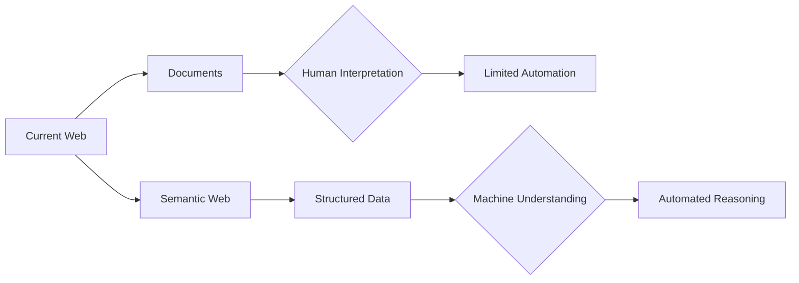
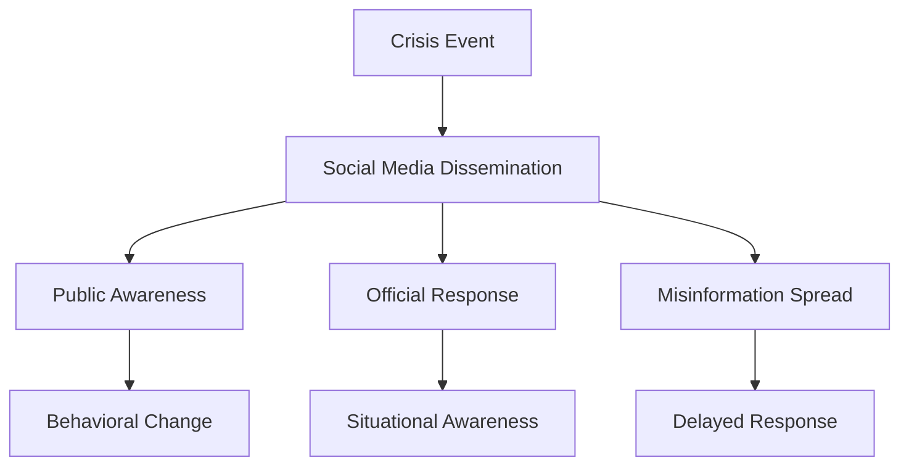
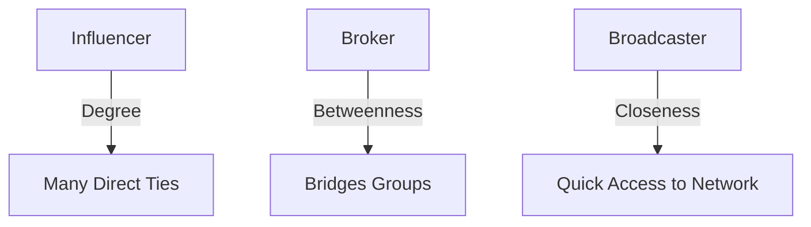
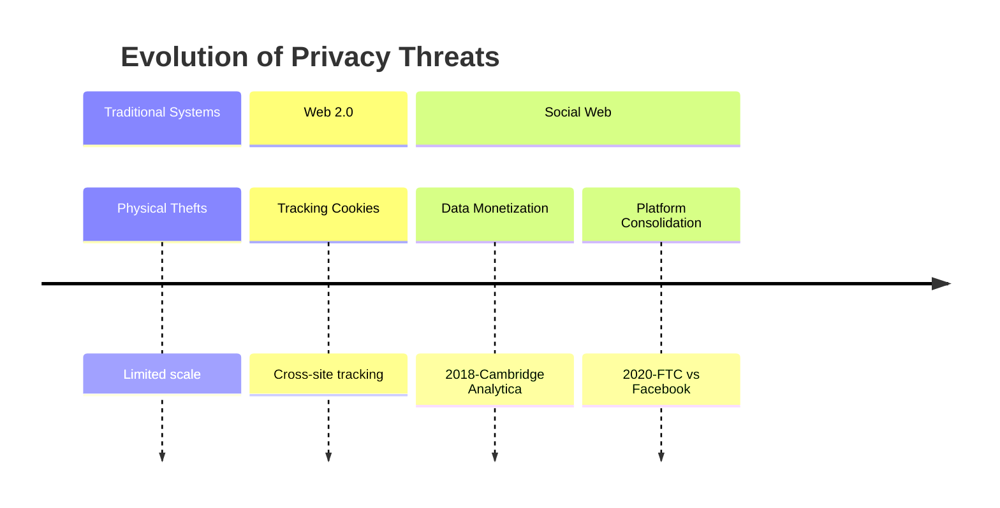
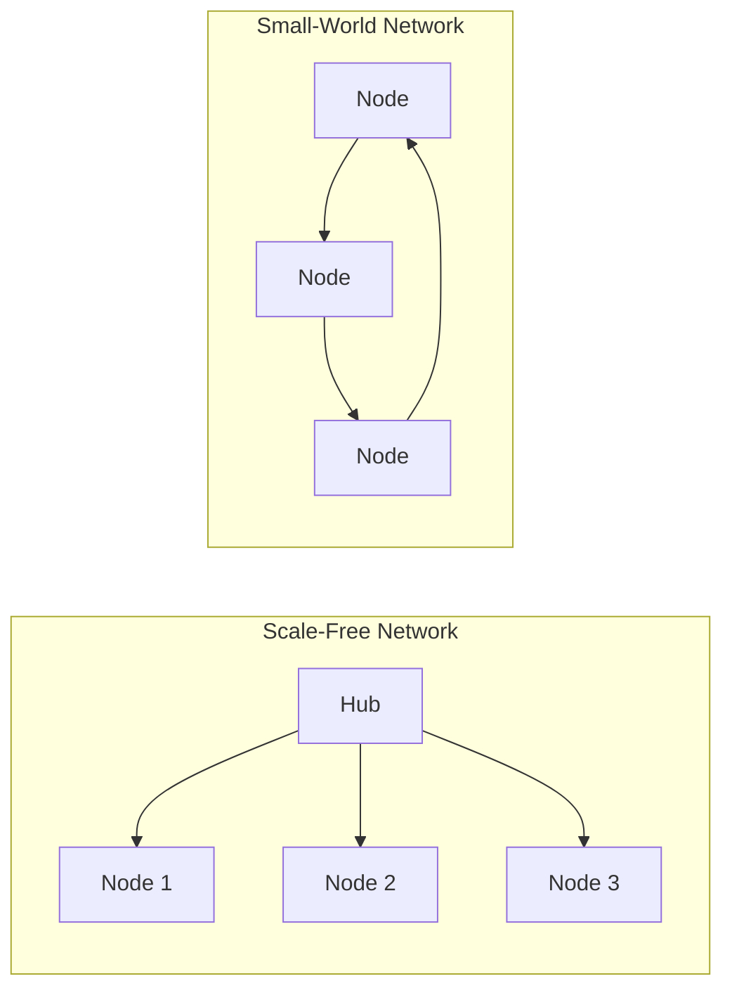
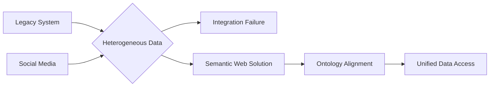
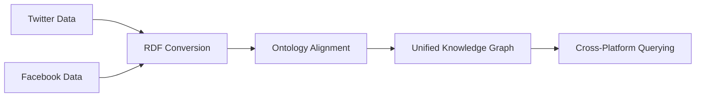

# **Social Networking Security Exam Preparation**

## **1. Transition from Current Web to Semantic Web**

**Definition:** The **Semantic Web** is an extension of the current web that adds meaning (**semantic meaning**) to data through **machine-readable metadata**, enabling computers to understand and process information intelligently without human intervention.

**Key Technologies:** **RDF (Resource Description Framework)** for data modeling, **OWL (Web Ontology Language)** for defining relationships, and **SPARQL** for querying semantic data.

**Diagram:**

**Real-World Case:** In healthcare, **semantic interoperability** enables different EHR systems to exchange and interpret patient data accurately. During COVID-19, semantic technologies allowed for **integrated patient care** across different healthcare providers, reducing medical errors and avoiding duplicate entries.

**Countermeasures:** Develop **domain-specific ontologies**, implement **RDF standardization**, and use **SPARQL endpoints** for unified data access.

**References:** 
1. Semantic Interoperability in Health Records (PMC8791650)
2. Heterogeneous Data Integration Challenges (ScienceDirect)

**Practice Questions:**
1. Compare the current web and Semantic Web in terms of data interpretation capabilities.
2. How does SPARQL enhance data querying capabilities compared to traditional SQL?

---

## **2. Social Web Impact on Crisis Information Dissemination**

**Definition:** **Crisis information dissemination** refers to the rapid spread of emergency-related information through **social media platforms** during public health events or disasters, influencing both **public decision-making** and **response coordination**.

**Key Aspects:** **Real-time communication**, **information redundancy**, and **public engagement** enhance crisis response, but **misinformation risks** can hinder effectiveness.

**Diagram:**

**Real-World Case:** During COVID-19, **Weibo** was used in megacities to disseminate crisis information. Studies showed that **social influence of publishers** significantly impacted information spread, with prediction models achieving **95% accuracy** in forecasting dissemination patterns.

**Countermeasures:** Implement **AI-driven monitoring** to detect misinformation, establish **official verification channels**, and promote **public digital literacy**.

**References:** 
1. Predicting Crisis Information Dissemination (ScienceDirect)
2. Social Media in Disasters (PrepareCenter)

**Practice Questions:**
1. Analyze two benefits and two risks of using social media for crisis communication.
2. How can authorities leverage social media to counter misinformation during disasters?

---

## **3. Network Centrality in Digital Marketing**

**Definition:** **Network centrality** measures the importance of nodes (users) in a social network based on their **connection patterns**, helping identify **key influencers** for targeted marketing.

**Key Metrics:** **Degree centrality** (number of direct connections), **betweenness centrality** (role as a bridge), and **closeness centrality** (proximity to all other nodes).

**Diagram:**

**Real-World Case:** A digital campaign for a health coalition used **degree centrality** to identify partners with the most connections for leadership roles, **betweenness centrality** to find information brokers, and **closeness centrality** to identify rapid information disseminators.

**Countermeasures:** Use **SNA tools** like PARTNER CPRM to calculate centrality metrics and **diversify influencer selection** to avoid over-reliance on single nodes.

**References:** 
1. Network Centrality Measures (Visible Network Labs)
2. Using Centrality to Identify Key Players (Visible Network Labs)

**Practice Questions:**
1. How would you use betweenness centrality to improve information flow in a marketing campaign?
2. Compare degree and closeness centrality in identifying influencers.

---

## **4. Evolution of Privacy Threats & Mitigation**

**Definition:** **Privacy threats** have evolved from isolated **traditional system breaches** to systematic **data exploitation** on social web platforms, where **behavioral advertising** and **data consolidation** amplify risks.

**Key Threats:** **Surveillance advertising** (e.g., Facebook microtargeting), **platform consolidation** (e.g., WhatsApp-Facebook data sharing), and **data breaches** exposing sensitive information.

**Diagram:**

**Real-World Case:** The **Cambridge Analytica scandal (2018)** involved unauthorized harvesting of **87 million Facebook users** data for political profiling, highlighting risks of **third-party data access** and **insufficient consent mechanisms**.

**Countermeasures:** Implement **comprehensive data protection laws** (e.g., GDPR), enforce **antitrust regulations** to prevent monopolistic data consolidation, and promote **privacy-by-design** architectures.

**References:** 
1. Social Media Privacy (EPIC.org)
2. Evolution of Social Media Algorithms (Multipost Digital)

**Practice Questions:**
1. How did the Cambridge Analytica scandal change perceptions of social media privacy?
2. Propose two strategies to reduce privacy risks from surveillance advertising.

---

## **5. Comparing Network Structures for Information Flow**

**Definition:** **Network efficiency** is measured by how quickly information spreads through a structure, using **centrality metrics** to compare alternative architectures.

**Key Metrics:** **Degree centrality** (direct influence), **betweenness centrality** (brokerage capacity), and **closeness centrality** (efficient dissemination).

**Comparison Table:**
| **Metric** | **Scale-Free Network** | **Small-World Network** |
|------------|------------------------|-------------------------|
| **Degree Centrality** | High (hubs) | Moderate (uniform) |
| **Betweenness Centrality** | Concentrated on hubs | Evenly distributed |
| **Closeness Centrality** | Variable (high for hubs) | High for all nodes |
| **Info Flow Efficiency** | Rapid but hub-dependent | Balanced and resilient |

**Diagram:**

**Real-World Case:** Research on **emergency response networks** showed that **scale-free networks** with high-degree hubs facilitated rapid information dissemination but were vulnerable to hub failure, while **small-world networks** offered more resilient but slower propagation.

**Countermeasures:** For scale-free networks, **add redundant connections** to hubs. For small-world networks, **increase clustering** to enhance local connectivity.

**References:** 
1. Network Centrality Measures (Visible Network Labs)
2. Degree Centrality in Social Networks (Bookdown)

**Practice Questions:**
1. Which network structure is more suitable for a disaster response system? Justify.
2. How does betweenness centrality affect information control?

---

## **6. Limitations of Current Web & Semantic Web Solutions**

**Definition:** The **current web** suffers from **syntactic heterogeneity** where data lacks uniform structure, causing **integration failures** due to incompatible formats and meanings.

**Key Limitations:** **Data silos** (e.g., proprietary health records), **schema mismatches** (e.g., different field definitions), and **ambiguous semantics** (e.g., varying terminology).

**Diagram:**

**Real-World Case:** A **healthcare integration project** failed because EHR systems used different standards (HL7 vs. FHIR), causing **semantic mismatches** in patient data interpretation. This led to **medication errors** and **duplicate tests**.

**Semantic Web Approach:** Use **OWL ontologies** to map terminology, **RDF** to standardize data representation, and **SPARQL** to query integrated data sources.

**Countermeasures:** Adopt **international standards** (e.g., HL7 FHIR), implement **ontology-based integration**, and use **LLMs** for schema alignment.

**References:** 
1. Semantic Interoperability in Health Records (PMC8791650)
2. Using LLMs for Semantic Interoperability (ScienceDirect)

**Practice Questions:**
1. How would ontologies resolve data integration failures in healthcare?
2. Compare traditional and Semantic Web approaches to data integration.

---

## **7. Semantic Web for Cross-Platform Interoperability**

**Definition:** **Semantic Web technologies** enable **cross-platform interoperability** by providing **standardized data models** (e.g., RDF) and **ontology alignment** techniques to integrate heterogeneous social media data.

**Key Technologies:** **RDF** for unified data representation, **OWL** for defining relationships, and **SPARQL** for federated querying across platforms.

**Diagram:**

**Real-World Case:** Research on **health data integration** showed that **FHIR standards** combined with **OWL ontologies** successfully integrated data from **Weibo**, **electronic health records**, and **public health databases** for COVID-19 monitoring, improving **data accuracy** and **decision-making speed**.

**Challenges:** **Schema heterogeneity** (e.g., different data models), **terminology conflicts** (e.g., varying field names), and **privacy constraints** (e.g., data sharing policies).

**Countermeasures:** Develop **cross-domain ontologies**, use **LLMs for schema matching**, and implement **privacy-preserving data integration** techniques.

**References:** 
1. Semantic Interoperability in Health Records (PMC8791650)
2. Using LLMs for Semantic Interoperability (ScienceDirect)

**Practice Questions:**
1. Evaluate the role of SPARQL in querying integrated social media data.
2. How can Semantic Web technologies address privacy concerns in data integration?

---

**Conclusion:** These questions cover key aspects of social network analysis, Semantic Web technologies, and privacy challenges. Focus on understanding centrality measures, semantic interoperability, and real-world cases for exam success.
