## 1. Illustrate the Transition from the Traditional Web to the Semantic Web with Suitable Examples

**Definition:** The **transition** from the **Traditional Web** (Web 1.0) to the **Semantic Web** (Web 3.0) represents a paradigm shift from **document-centric** information to **machine-readable data** interconnected through **ontologies** and **metadata**. This evolution enables **intelligent processing** by machines rather than just human consumption.

**Key Differences:**

| Aspect | Traditional Web (Web 1.0) | Semantic Web (Web 3.0) |
|--------|---------------------------|------------------------|
| **Content Type** | Static documents | Linked data and knowledge graphs |
| **Primary Consumers** | Humans | Machines and humans |
| **Data Structure** | Unstructured HTML | Structured RDF/OWL formats |
| **Interoperability** | Limited | Enhanced through ontologies |
| **Search Mechanism** | Keyword-based | Context-aware and semantic |

**Example:** 
- **Traditional Web:** A Wikipedia page about "Apple" contains text and images that humans read to determine if it refers to the fruit or company
- **Semantic Web:** Metadata tags explicitly define whether "Apple" refers to <Apple_Fruit> or <Apple_Inc>, enabling machines to accurately process queries

**Diagram:** 
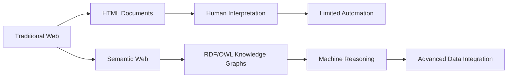

**Real-World Case:** Google's **Knowledge Graph** (launched 2012) uses Semantic Web technologies to provide direct answers to queries by understanding semantic relationships between entities rather than just matching keywords.

**Countermeasures for Transition Challenges:** Use of **RDFa** to embed semantic markup in existing HTML documents, allowing gradual implementation without complete system overhauls.

**Reference:** 
1. Shadbolt, N., Berners-Lee, T., & Hall, W. (2006). The Semantic Web Revisited. IEEE Intelligent Systems.
2. GeeksforGeeks: Semantic Web Tutorial

## 2. The Purpose of RDF and OWL in Enabling Machine-Readable Content

**Definition:** **Resource Description Framework (RDF)** provides a standardized **data model** for representing information as **triples** (subject-predicate-object), while **Web Ontology Language (OWL)** adds **vocabulary** for defining complex **ontologies** with formal semantics, enabling **logical inference** and **knowledge reasoning**.

**Key Functions:**
- **RDF:** Creates machine-readable statements about resources (<https://example.org/John> <http://xmlns.com/foaf/0.1/knows> <https://example.org/Mary>)
- **OWL:** Defines formal ontologies with class hierarchies, property characteristics, and constraints

**Example:** 
In a social network context:
- **RDF** expresses: "User A follows User B"
- **OWL** defines: "If User A follows User B, and User B follows User C, then User A might know User C" (through property transitivity)

**Diagram:**
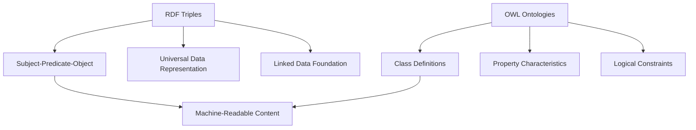

**Security Implications:** Proper ontological modeling helps prevent **data misinterpretation** by systems, reducing errors in automated decision making. However, inconsistent ontologies can create **integration vulnerabilities**.

**Real-World Case:** The **Facebook Open Graph Protocol** uses RDF-like structures to define relationships between people, objects, and activities across the web, enabling consistent machine interpretation of social connections.

**Countermeasures:** Implementation of **ontology validation tools** and shared **upper ontologies** to ensure consistency across domains.

**Reference:** 
1. Antoniou, G., & Van Harmelen, F. (2004). A Semantic Web Primer. MIT Press.
2. W3C RDF Primer: https://www.w3.org/TR/rdf-primer/

## 3. Compare the Structural Differences Between a Centralised and a Decentralised Social Network

**Definition:** **Centralized social networks** rely on a **single authority** that controls data storage and processing, while **decentralized social networks** distribute authority across **multiple nodes** using **peer-to-peer** architectures or **federated** systems.

**Key Differences:**

| Aspect | Centralized Networks | Decentralized Networks |
|--------|----------------------|------------------------|
| **Control** | Single entity | Distributed among users |
| **Data Storage** | Central servers | Across multiple nodes |
| **Censorship Resistance** | Low | High |
| **Performance** | Typically faster | Can be slower due to replication |
| **Examples** | Facebook, Twitter | Mastodon, Diaspora |

**Example:** 
- **Centralized:** Twitter stores all tweets on its servers and controls content moderation policies globally
- **Decentralized:** Mastodon allows independent communities to host their own instances while enabling cross-instance communication through the ActivityPub protocol

**Diagram:**
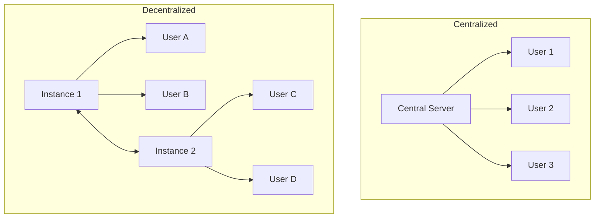

**Security Implications:** Centralized networks present **single points of failure** and are vulnerable to **mass data breaches** (e.g., Facebook Cambridge Analytica incident ). Decentralized networks reduce this risk but face challenges with **consistent content moderation** and **protocol-level vulnerabilities**.

**Real-World Case:** The **Diaspora*** social network, launched in 2010 as a response to Facebook's privacy issues, implemented a decentralized model where users control their own "pods" containing personal data.

**Countermeasures:** For decentralized networks, implementation of **end-to-end encryption** and **consensus mechanisms** for content validation across nodes.

**Reference:** 
1. Tran, T., et al. (2021). Decentralized Social Networks: Architecture, Challenges, and Solutions. IEEE Communications Surveys & Tutorials.
2. Geiger, R. S. (2022). The Fediverse: A Review of Privacy and Security Features in Decentralized Social Networks.

## 4. Interpret the Role of Degree Centrality in Identifying Active Participants Within a Social Network

**Definition:** **Degree centrality** is a **network metric** that quantifies the number of **direct connections** a node has to other nodes in the network, serving as an indicator of **activity level** or **popularity** within the network structure.

**Calculation:** For a node, degree centrality = Number of direct ties to other nodes

**Example:** In a professional network like LinkedIn:
- A user with 500+ connections has high degree centrality
- A user with only 10 connections has low degree centrality
- The user with high degree centrality is likely an active participant who frequently engages with others

**Diagram:**
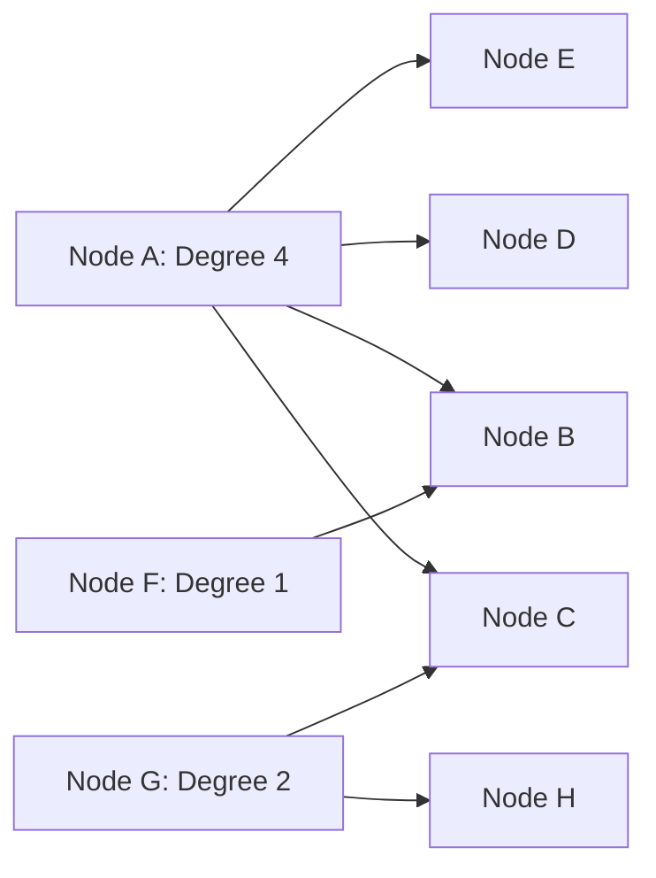

**Security Implications:** Nodes with **high degree centrality** can be valuable **attack targets** as compromising them would expose many connections. They can also serve as effective **trusted distributors** for security patches or warnings within the network.

**Real-World Case:** In the 2016 Twitter Bitcoin scam, hackers targeted verified accounts with high degree centrality (celebrities, politicians) to maximize the spread of their fraudulent message .

**Countermeasures:** Implement **adaptive authentication measures** for high-degree nodes and continuous monitoring of their activity patterns for anomalies.

**Reference:** 
1. Freeman, L. C. (1978). Centrality in Social Networks Conceptual Clarification. Social Networks.
2. Wasserman, S., & Faust, K. (1994). Social Network Analysis: Methods and Applications.

## 5. Identify How Semantic Web Improves Knowledge Representation Over Traditional HTML-Based Web Systems

**Definition:** The **Semantic Web** enhances **knowledge representation** by adding **formal semantics** to data through **ontologies** and **structured metadata**, enabling **machine interpretation** of meaning rather than just human-readable presentation.

**Key Improvements:**

1. **Explicit Meaning**: Data is accompanied by semantic metadata defining precise meaning
2. **Interoperability**: Standardized models (RDF, OWL) enable data integration across sources
3. **Inference Capability**: Machines can derive new knowledge through logical reasoning

**Example:** 
- **HTML:** `<b>Apple</b>` presents the word with formatting but no semantic meaning
- **Semantic Web:** `<rdf:Description rdf:about="Apple"><rdf:type rdf:resource="http://ontology.com/Fruit"/></rdf:Description>` explicitly defines Apple as a fruit

**Diagram:**
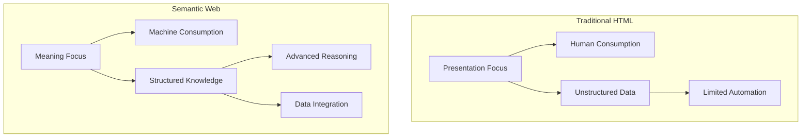

**Security Implications:** Semantic Web technologies enable more **precise access control policies** based on semantic relationships rather than just syntax. However, **ontology poisoning** attacks could manipulate inference results.

**Real-World Case:** The **BBC's linked data initiative** used Semantic Web technologies to create a unified knowledge base connecting content across their website, dramatically improving content discoverability and integration.

**Countermeasures:** Use of **digital signatures** for ontological definitions and **reasoning validation** mechanisms to detect inconsistent inferences.

**Reference:** 
1. Berners-Lee, T., Hendler, J., & Lassila, O. (2001). The Semantic Web. Scientific American.
2. GeeksforGeeks: Semantic Web vs Traditional Web

## 6. Differentiate the Concepts of Closeness Centrality and Betweenness Centrality in Network Analysis

**Definition:** **Closeness centrality** measures how **close** a node is to all other nodes in the network based on **shortest path distances**, identifying nodes that can quickly interact with the entire network. **Betweenness centrality** measures how often a node lies on the **shortest path** between other nodes, identifying nodes that act as **bridges** or **gatekeepers** between network parts.

**Calculation:**
- Closeness Centrality = 1 / sum of shortest path distances to all other nodes
- Betweenness Centrality = Σ (number of shortest paths between s and t that pass through v) / (total number of shortest paths between s and t)

**Example:** In an office communication network:
- The CEO might have high **closeness centrality** as they're directly connected to many departments
- An administrative assistant might have high **betweenness centrality** as they facilitate communication between different departments

**Diagram:**
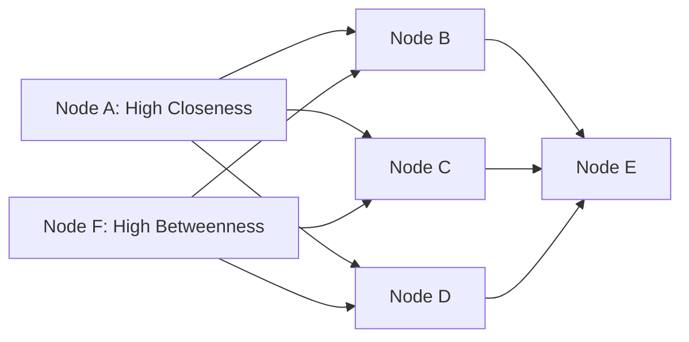

**Security Implications:** Nodes with high **betweenness centrality** can be critical **chokepoints** for network security—monitoring these nodes can detect intrusion attempts, while compromising them enables **eavesdropping** on communications. Nodes with high **closeness centrality** are ideal for **rapid dissemination** of security updates.

**Real-World Case:** In cybersecurity analysis of corporate networks, betweenness centrality helps identify **critical routers** that, if compromised, would allow attackers to monitor traffic between multiple network segments.

**Reference:** 
1. Freeman, L. C. (1977). A Set of Measures of Centrality Based on Betweenness. Sociometry.
2. Brandes, U. (2001). A Faster Algorithm for Betweenness Centrality. Journal of Mathematical Sociology.

## 7. Summarize the Core Features of the Social Web That Distinguish It from the Traditional Web

**Definition:** The **Social Web** (Web 2.0) represents a fundamental shift from **static consumption** to **dynamic participation**, characterized by **user-generated content**, **social interactions**, and **collaborative creation** that distinguishes it from the passive consumption model of the Traditional Web (Web 1.0).

**Key Distinguishing Features:**

1. **User-Generated Content**: Users create and share content rather than just consuming it
2. **Network Effects**: Value increases with more users and interactions
3. **Rich Interactions**: Comments, likes, shares, and other social engagements
4. **Collaborative Creation**: Wikis, collaborative filtering, and collective intelligence
5. **Platform Economy**: APIs enable third-party innovations atop core platforms

**Example:** 
- **Traditional Web:** CNN.com publishing news articles for readers to consume
- **Social Web:** Twitter allowing users to create tweets, retweet others, and follow conversations

**Diagram:**
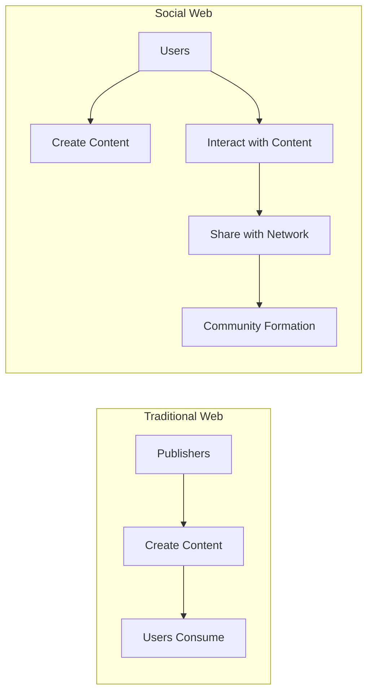

**Security Implications:** The Social Web introduces **new attack vectors** including **social engineering**, **identity theft**, and **viral misinformation**. Privacy concerns escalate as users voluntarily share personal information that can be **aggregated** and **exploited**.

**Real-World Case:** The **Facebook-Cambridge Analytica scandal** (2018) demonstrated how social web features (APIs, data sharing, network effects) could be exploited to harvest personal data of millions of users without consent for political advertising .

**Countermeasures:** Implementation of **granular privacy controls**, **audit trails** for data access, and **user education** on data sharing practices.

**Reference:** 
1. O'Reilly, T. (2005). What Is Web 2.0: Design Patterns and Business Models for the Next Generation of Software. O'Reilly Media.
2. Zimmer, M. (2008). The Externalities of Web 2.0: On the Convergence of Great Promise and Great Risk.

## 8. The Significance of Ontologies in Achieving Interoperability in Web-Based Systems to Be Discussed with Relevant Details

**Definition:** **Ontologies** provide formal, explicit specifications of **shared conceptualizations** that enable **interoperability** between web-based systems by establishing common **vocabularies**, **semantic relationships**, and **logical frameworks** for consistent information exchange across heterogeneous platforms.

**Key Functions for Interoperability:**

1. **Vocabulary Alignment**: Establishing common terms and definitions
2. **Semantic Mapping**: Defining relationships between concepts from different sources
3. **Logic Consistency**: Ensuring integrated information doesn't create contradictions
4. **Knowledge Inference**: Enabling derivation of new knowledge from integrated data

**Example:** In healthcare systems, an ontology can reconcile differences between:
- System A: "Myocardial Infarction" 
- System B: "Heart Attack"
- System C: "MI"
By defining all terms as equivalent in a medical ontology

**Diagram:**
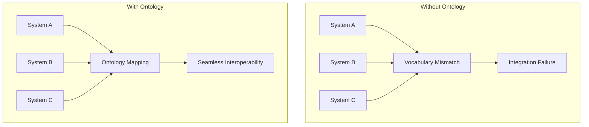

**Security Implications:** Proper ontological alignment enables **secure data integration** with preserved meaning across systems. However, **ontology manipulation** attacks could deliberately create misinterpretations during data exchange.

**Real-World Case:** The **National Cancer Institute Thesaurus** ontology enables interoperability between diverse cancer research databases, clinical systems, and research institutions by providing standardized definitions of cancer-related terms and relationships.

**Countermeasures:** Use of **digitally signed ontologies**, **ontology versioning systems**, and **consistency checkers** to ensure ontological integrity across systems.

**Reference:** 
1. Gruber, T. R. (1993). A Translation Approach to Portable Ontology Specifications. Knowledge Acquisition.
2. Uschold, M., & Gruninger, M. (1996). Ontologies: Principles, Methods and Applications. Knowledge Engineering Review.

## 9. Demonstrate the Influence of Social Media Networks on Shaping Public Opinion During Elections

**Definition:** **Social media networks** significantly influence **public opinion** during elections through **algorithmic content curation**, **targeted messaging**, **information cascades**, and **network effects** that shape voter perceptions, attitudes, and behaviors at unprecedented scale and speed.

**Key Influence Mechanisms:**

1. **Selective Exposure**: Algorithms create echo chambers by showing content that aligns with users' existing views
2. **Agenda Setting**: Platforms determine which issues receive attention through trending topics and recommendations
3. **Microtargeting**: Political ads tailored to specific demographic and psychographic profiles
4. **Opinion Leadership**: Influencers shape perceptions within their networks

**Example:** During the 2020 U.S. elections, campaign strategies heavily relied on social media platforms for:
- Voter mobilization through targeted messaging
- Dissemination of campaign materials
- Countering opposition narratives
- Encouraging voter registration and turnout

**Diagram:**
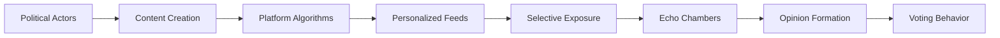

**Security Implications:** Social media enables **foreign interference** through coordinated inauthentic behavior, **microtargeted disinformation**, and **deepfake propaganda**. The 2016 U.S. elections demonstrated how social media could be weaponized to influence democratic processes .

**Real-World Case:** The **Cambridge Analytica scandal** revealed how personal data from millions of Facebook users was used to create psychological profiles and deliver microtargeted political advertising during the 2016 U.S. presidential election and Brexit referendum .

**Countermeasures:** **Transparency in political advertising**, **algorithmic accountability**, **digital literacy education**, and **cross-platform collaboration** to detect coordinated manipulation campaigns.

**Reference:** 
1. Jamieson, K. H. (2018). Cyberwar: How Russian Hackers and Trolls Helped Elect a President. Oxford University Press.
2. Persily, N., & Tucker, J. A. (2020). Social Media and Democracy: The State of the Field, Prospects for Reform.

## 10. Distinguish Between Structural Holes and Bridges in the Context of Social Network Connectivity

**Definition:** **Structural holes** are gaps between **non-redundant contacts** in a network where there is an absence of connection, creating opportunities for **information brokerage**. **Bridges** are single ties that **connect two otherwise separated clusters** in a network, serving as crucial pathways for information flow between groups.

**Key Differences:**

| Aspect | Structural Holes | Bridges |
|--------|------------------|---------|
| **Definition** | Gap between disconnected clusters | Specific connection spanning clusters |
| **Focus** | Position of broker between groups | Specific tie connecting groups |
| **Measurement** | Constraint coefficient | Edge betweenness |
| **Benefit** | Information control and innovation | Information flow and diffusion |

**Example:** In an organizational network:
- A **structural hole** exists between the R&D and Marketing departments if they have no direct connections
- A **bridge** would be a specific employee who has connections to both departments

**Diagram:**
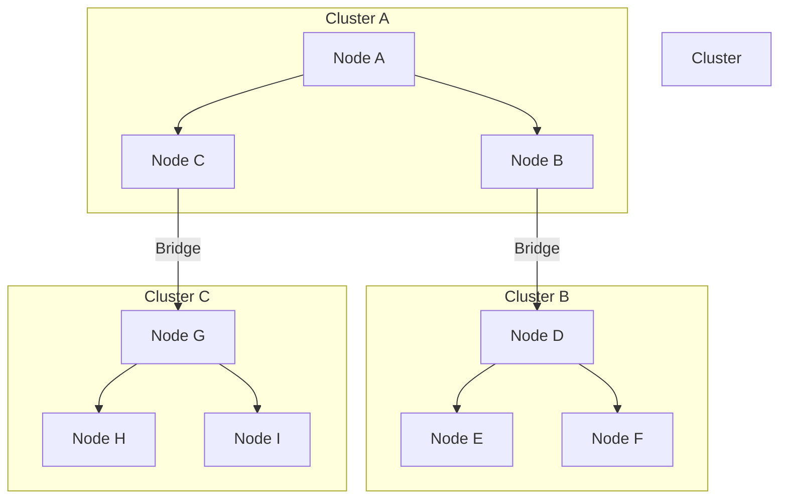

**Security Implications:** Nodes spanning structural holes can become **critical security gatekeepers** but also **single points of failure**. Bridges can be exploited as **vulnerable pathways** for cross-network contamination during cyber attacks.

**Real-World Case:** Ronald Burt's study of supply chain managers found that those who bridged structural holes were more likely to receive positive performance evaluations, higher compensation, and faster promotions .

**Countermeasures:** **Redundant bridging connections** to avoid single points of failure and **monitoring bridge traffic** for anomalous cross-network activity.

**Reference:** 
1. Burt, R. S. (1992). Structural Holes: The Social Structure of Competition. Harvard University Press.
2. Granovetter, M. S. (1973). The Strength of Weak Ties. American Journal of Sociology.

## 11. Analyze a Scenario Where Information Flow in a Network Is Disrupted and Propose a Structural Solution

**Definition:** **Information flow disruption** occurs when **network pathways** are blocked or degraded, preventing efficient communication between nodes. **Structural solutions** involve modifying **network topology** to create alternative pathways and enhance **robustness** against such disruptions.

**Scenario Analysis:** A natural disaster damages key communication infrastructure in a regional emergency response network, creating **information bottlenecks** that prevent coordination between first responders.

**Structural Problems:**
1. **Over-reliance** on centralized communication towers
2. **Lack of redundant pathways** between critical nodes
3. **Network fragmentation** into isolated components

**Proposed Structural Solutions:**

1. **Mesh Network Topology**: Create multiple interconnected pathways for redundant communication
2. **Decentralized Hubs**: Distribute critical functions across multiple nodes
3. **Mobile Bridge Nodes**: Deploy portable communication units to reconnect fragmented components

**Diagram:**
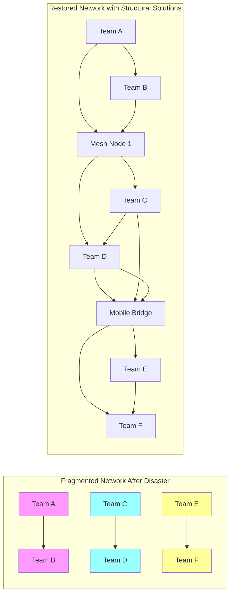

**Security Implications:** Structural solutions must balance **redundancy** with **security**—increasing pathways also expands the **attack surface**. Implementation of **encryption** and **access control** across all redundant pathways is essential.

**Real-World Case:** Following Hurricane Katrina's communication failures, emergency response networks implemented **mesh network technologies** with **mobile ad-hoc capabilities** to maintain connectivity during infrastructure outages.

**Reference:** 
1. Albert, R., Jeong, H., & Barabási, A. L. (2000). Error and Attack Tolerance of Complex Networks. Nature.
2. Holmgren, Å. J. (2006). Using Graph Models to Analyze the Vulnerability of Electric Power Networks. Risk Analysis.

## 12. Associate the Key Stages in the Development of Social Network Analysis with Modern Research Applications

**Definition:** The **historical development** of Social Network Analysis (SNA) progressed through distinct stages from **theoretical foundations** to **computational analytics**, enabling modern applications across diverse domains from public health to cybersecurity.

**Key Developmental Stages:**

1. **Theoretical Foundations** (1930s-1950s): Jacob Moreno's sociograms, Kurt Lewin's field theory
2. **Mathematical Formalization** (1960s-1970s): Graph theory applications, centrality measures
3. **Computational Expansion** (1980s-1990s): Computer-enabled analysis of larger networks
4. **Digital Revolution** (2000s-2010s): Online social networks, big data analytics
5. **AI Integration** (2020s-present): Machine learning, predictive modeling

**Modern Research Applications:**

- **Public Health**: Contact tracing for epidemic control 
- **Counterterrorism**: Identifying key nodes in terrorist networks
- **Cybersecurity**: Mapping vulnerability propagation in computer networks
- **Marketing**: Identifying influencers for viral campaigns

**Diagram:**
```mermaid
timeline
title SNA Development Timeline
section 1930s-1950s: Theoretical Foundations
  Sociograms : Moreno
  Field Theory : Lewin
section 1960s-1970s: Mathematical Formalization
  Graph Theory : Harary
  Centrality Measures : Freeman
section 1980s-1990s: Computational Expansion
  Software Development : UCINET
  Large Network Analysis : 
section 2000s-2010s: Digital Revolution
  Online Social Networks : 
  Big Data Analytics : 
section 2020s-present: AI Integration
  Machine Learning : 
  Predictive Modeling : 
```

**Security Implications:** Modern SNA enables **proactive security** by identifying **structural vulnerabilities** before exploitation. However, **privacy concerns** emerge as network analysis techniques become increasingly powerful for profiling and prediction.

**Real-World Case:** During the COVID-19 pandemic, SNA was extensively applied to model disease spread patterns and optimize contact tracing efforts, dramatically improving containment effectiveness compared to previous approaches.

**Reference:** 
1. Scott, J. (2017). Social Network Analysis. Sage Publications.
2. Borgatti, S. P., Mehra, A., Brass, D. J., & Labianca, G. (2009). Network Analysis in the Social Sciences. Science.

## 13. Outline the Implications of Privacy Concerns in Data Sharing Across Social Platforms

**Definition:** **Privacy concerns** in social platform data sharing encompass issues of **consent violation**, **data aggregation**, **secondary usage**, and **surveillance capitalism**, creating risks of **identity theft**, **discrimination**, and **manipulation** that undermine user autonomy and trust.

**Key Implications:**

1. **Individual Impacts**: Identity theft, reputational damage, psychological distress
2. **Societal Impacts**: Chilling effects on free expression, erosion of trust in digital institutions
3. **Democratic Impacts**: Manipulation of voter behavior, undermining of electoral integrity
4. **Economic Impacts**: Uneven value distribution between platforms and users whose data generates value

**Example:** When users agree to a social platform's terms of service, they typically grant broad permissions for:
- Collection of extensive personal data
- Tracking across other websites and apps
- Data sharing with third parties
- Use of data for targeted advertising

**Diagram:**
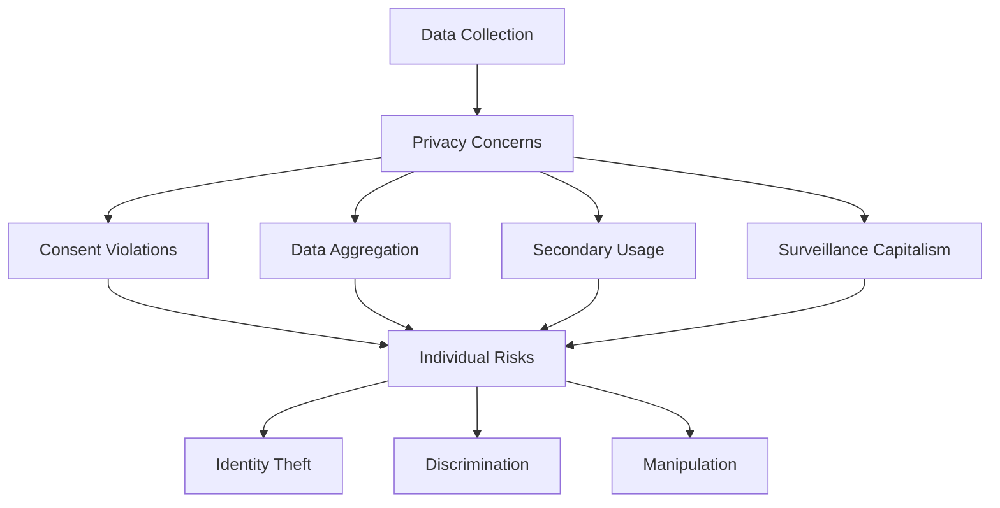

**Security Implications:** Privacy violations create **expanded attack surfaces** for malicious actors through **data aggregation breaches**. The **Facebook-Cambridge Analytica scandal** demonstrated how apparently innocuous data could be combined into powerful psychological profiling tools .

**Real-World Case:** In 2021, LinkedIn faced scrutiny after data from 700 million users (92% of its user base) was scraped and offered for sale on dark web markets, demonstrating how even professional social networks face significant data protection challenges.

**Countermeasures:** Implementation of **privacy-by-design principles**, **differential privacy techniques**, **federated learning**, and **stronger regulatory frameworks** like GDPR and CCPA.

**Reference:** 
1. Zuboff, S. (2019). The Age of Surveillance Capitalism: The Fight for a Human Future at the New Frontier of Power. PublicAffairs.
2. Solove, D. J. (2008). Understanding Privacy. Harvard University Press.

## 14. Examine the Role of Historical Privacy Paradigms in Shaping Current Online Data Protection Policies

**Definition:** **Historical privacy paradigms**—including **Warren and Brandeis's "Right to be Let Alone"** (1890), **Westin's Information Self-Determination** (1967), and **Nissenbaum's Contextual Integrity** (2004)—have fundamentally shaped modern data protection policies by establishing philosophical foundations for digital privacy rights.

**Key Paradigm Influences:**

1. **Right to Privacy** (1890): Established privacy as a legal concept influencing later data protection laws
2. **Fair Information Practice Principles** (1970s): Provided framework for modern privacy regulations
3. **Privacy as Contextual Integrity** (2004): Recognized that privacy norms vary across social contexts

**Example:** The European Union's **General Data Protection Regulation (GDPR)** incorporates elements from multiple historical paradigms:
- **Right to be forgotten** from the Right to Privacy paradigm
- **Purpose limitation** from FIPPs
- **Context-appropriate protections** from Contextual Integrity

**Diagram:**
```mermaid
timeline
title Privacy Paradigms Evolution
section 1890
  Right to be Let Alone :
    Warren & Brandeis
section 1967
  Information Self-Determination :
    Alan Westin
section 1970s
  FIPPs : 
    US HEW Report
section 1995
  EU Data Protection Directive :
    EU Legislation
section 2004
  Contextual Integrity :
    Helen Nissenbaum
section 2018
  GDPR :
    EU Legislation
```

**Security Implications:** Modern data protection regulations like GDPR create **security requirements** including **data encryption**, **breach notification**, and **privacy-by-design** that significantly impact how organizations implement cybersecurity measures.

**Real-World Case:** The **EU-US Privacy Shield** framework (invalidated in 2020) attempted to reconcile different privacy paradigms between European and American approaches, demonstrating ongoing tensions between privacy as fundamental right versus market commodity.

**Countermeasures:** Organizations should implement **privacy impact assessments**, **data minimization strategies**, and **context-aware access controls** to comply with evolving regulatory frameworks inspired by these historical paradigms.

**Reference:** 
1. Warren, S. D., & Brandeis, L. D. (1890). The Right to Privacy. Harvard Law Review.
2. Nissenbaum, H. (2004). Privacy as Contextual Integrity. Washington Law Review.

## 15. Apply Network Analysis Concepts to Assess the Vulnerability of a Communication Network During a Cyberattack

**Definition:** **Network analysis concepts** including **centrality measures**, **connectivity metrics**, and **community structure** provide systematic frameworks for assessing **cyberattack vulnerability** by identifying critical nodes, fragile connections, and structural weaknesses in communication networks.

**Assessment Framework:**

1. **Identify Critical Assets**: Map network components and their importance
2. **Analyze Network Topology**: Calculate centrality measures and connectivity patterns
3. **Model Attack Scenarios**: Simulate various cyberattack approaches
4. **Quantify Impact**: Measure potential damage from successful attacks

**Example:** Assessing a corporate network for vulnerability to a **DDoS attack**:
- Use **degree centrality** to identify highly connected routers that could be overwhelmed
- Apply **betweenness centrality** to find critical bridges whose failure would fragment the network
- Analyze **community structure** to determine if segmentation could contain damage

**Diagram:**
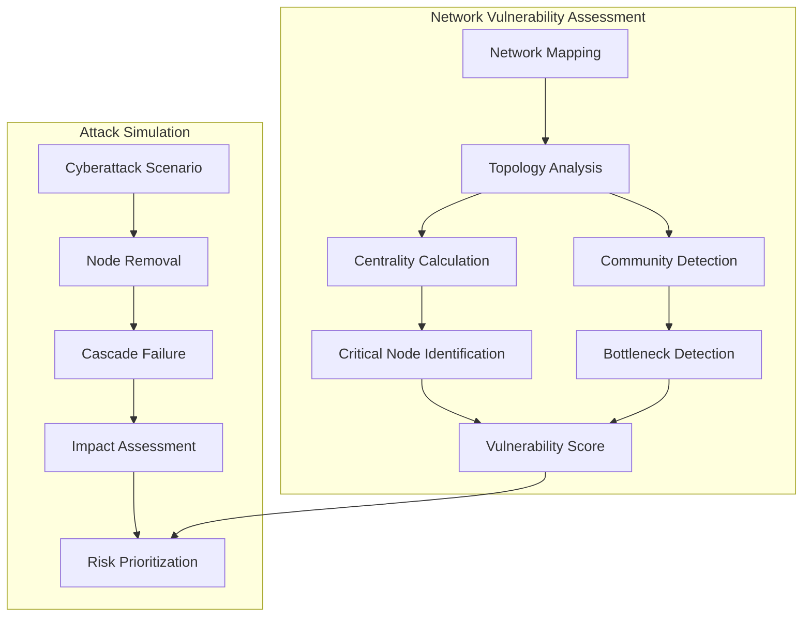

**Security Implications:** Network analysis helps prioritize **security resource allocation** to protect most critical nodes. However, attackers can use similar techniques to **identify valuable targets**, creating an arms race in network analysis capabilities.

**Real-World Case:** The 2015 **Ukraine power grid cyberattack** demonstrated how attackers could use network analysis to identify critical control systems whose compromise would cause maximum disruption .

**Countermeasures:** Implement **network redundancy** for critical nodes, **segmentation** to limit cascade failures, and **dynamic topology reconfiguration** capabilities to adapt during attacks.

**Reference:** 
1. Sommestad, T., & Ekstedt, M. (2016). The System Under Investigation and the Cyber Security Modeling Language. IEEE Transactions on Dependable and Secure Computing.
2. Buldyrev, S. V., Parshani, R., Paul, G., Stanley, H. E., & Havlin, S. (2010). Catastrophic Cascade of Failures in Interdependent Networks. Nature.

## Practice Questions

### Social Network Analysis
1. Explain how betweenness centrality could be used to identify critical infrastructure nodes in a smart grid network.
2. Compare the advantages and disadvantages of using degree centrality versus eigenvector centrality for identifying influencers in a social media network.
3. Describe how structural hole theory might explain information silos in a large multinational organization.

### Semantic Web
1. Create an RDF schema for describing research papers and their citations in a academic domain.
2. Explain how OWL ontologies can enable interoperability between healthcare systems using different patient data formats.
3. Compare the capabilities of RDF-Schema and OWL for defining semantic relationships between concepts.

### Privacy and Security
1. Design a privacy-preserving social network analysis technique that could identify community structures without accessing individual user data.
2. Explain how differential privacy could be applied to social network data to prevent re-identification attacks.
3. Analyze the ethical implications of using social network analysis for cybersecurity monitoring in organizational networks.

## References

1. Burt, R. S. (1992). Structural Holes: The Social Structure of Competition. Harvard University Press. 
2. Berners-Lee, T., Hendler, J., & Lassila, O. (2001). The Semantic Web. Scientific American. 
3. Freeman, L. C. (1978). Centrality in Social Networks Conceptual Clarification. Social Networks. 
4. Zuboff, S. (2019). The Age of Surveillance Capitalism: The Fight for a Human Future at the New Frontier of Power. PublicAffairs. 
5. Barabási, A. L. (2016). Network Science. Cambridge University Press. 
6. EPIC.org. (2023). Social Media Privacy. 
7. Rutgers University. (2023). How Media – Namely News, Ads and Social Posts Can Shape Election. 
8. ScienceDirect. (2022). Vulnerability analysis of cyber physical systems under the false alarm cyber attacks. 
9. Visible Network Labs. (2023). Social Network Analysis 101: Ultimate Guide. 
10. Teamup Blog. (2024). Improve Operational Efficiency with Better Information Flow. 

This comprehensive guide covers key concepts in Social Network Analysis and related topics formatted for Anna University exams. Each section includes definitions, examples, diagrams, security implications, and references to provide complete beginner-friendly explanations for 4-mark exam questions.
