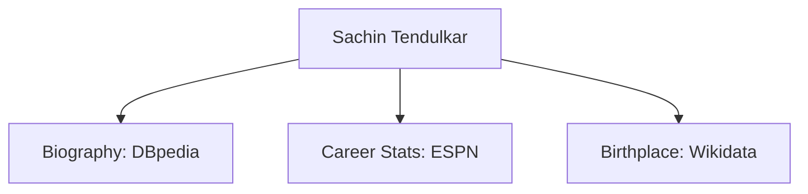
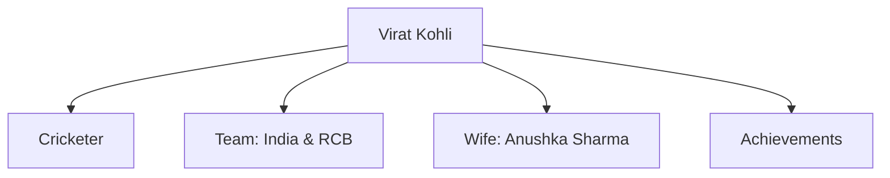
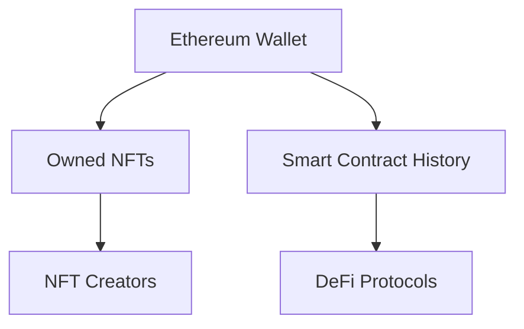

# 🌐 Linked Data & Knowledge Graph in Web 3

## 1. 🔗 Linked Data

### 📖 Definition

**Linked Data** means connecting information across the web in a **structured way** using:

* **URIs (Uniform Resource Identifiers)** → to uniquely identify resources.
* **RDF (Resource Description Framework)** → to represent data in machine-readable triples (subject–predicate–object).

Instead of **isolated databases (silos)**, linked data allows datasets to be **interlinked and reusable**.

👉 **Goal**:
Enable **machines, applications, and people** to discover, connect, and reuse data from different sources automatically.

---

### 🔹 Example: Sachin Tendulkar

If you search for **"Sachin Tendulkar"**, linked data can automatically connect:

* **DBpedia (Wikipedia structured data)** → Biography
* **ESPN** → Career stats
* **Wikidata** → Birthplace

All linked into a **single machine-readable graph**.

---

## 2. 🧠 Knowledge Graph

### 📖 Definition

A **Knowledge Graph** is a **network of entities (people, places, things)** and their **relationships**, stored in a **graph structure**.

* Built on **Linked Data principles**.
* Represents **facts + connections**, not just documents.

👉 **Key Idea**: Moves from **text-based search** → to **relationship-based knowledge**.

---

### 🔹 Example: Virat Kohli in Google Knowledge Graph

If you search for **"Virat Kohli"**, the graph shows:

* **Who he is** → Cricketer
* **His team** → RCB, India
* **Wife** → Anushka Sharma
* **Achievements** → Records, Awards

---

## 3. 🚀 Linked Data & Knowledge Graph in **Web 3**

### 🌐 What Web 3 Adds

Web 3 introduces **decentralization, blockchain, and trustless systems**.

* **Linked Data in Web 3**

  * Data stored on **blockchain** or **decentralized storage** (IPFS, Filecoin).
  * Still interlinked using **URIs + RDF standards**.
  * Example: **Supply chain data** stored across multiple blockchains, but connected via Linked Data.

* **Knowledge Graph in Web 3**

  * Organizes **decentralized data** into meaningful **relationships**.
  * Used in:

    * **Decentralized Identity (DID)**
    * **DeFi Knowledge Graphs**
    * **NFT metadata**
    * **Semantic search on blockchain**

---

### 🔹 Example: Web3 Knowledge Graph (Ethereum Wallet)

Here:

* A wallet links to **NFTs owned**
* NFTs link to **creators**
* Wallet also connects to **smart contract history & DeFi interactions**

---

## ✅ In Simple Words

* **Linked Data** = Rules & standards (URIs + RDF) to **connect decentralized data**.
* **Knowledge Graph** = The **actual network** (graph) of **entities & relationships** built using Linked Data.
* **In Web3** → Both make decentralized data:

  * **Searchable** 🔍
  * **Understandable** 🧠
  * **Interoperable** 🤝
  * **Usable for dApps, AI, and end-users** 🚀
