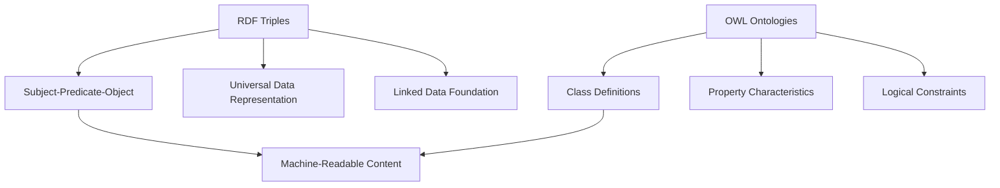

# 🕸️ RDF and OWL in the Semantic Web

## 1. 📖 Definitions

### 🔹 **Resource Description Framework (RDF)**

* A **standardized data model** for representing information in the form of **triples**:
  **(subject – predicate – object)**
* RDF provides the foundation for **Linked Data** by making information **machine-readable**.

👉 Example:

```turtle
<https://example.org/John> <http://xmlns.com/foaf/0.1/knows> <https://example.org/Mary> .
```

➡️ “John knows Mary.”

---

### 🔹 **Web Ontology Language (OWL)**

* Extends RDF by adding a **formal vocabulary for ontologies**.
* Provides **logic-based semantics**, enabling **inference and reasoning**.
* Supports:

  * **Class hierarchies** → `Person ⊆ Human`
  * **Property characteristics** → `knows` is symmetric
  * **Constraints** → A person has only **one birthdate**

👉 Example:

* **RDF**: `"User A follows User B"` (just a fact).
* **OWL**: `"If A follows B and B follows C → A might know C"` (reasoning via transitivity).

---

## 2. ⚡ Key Functions

| Aspect       | RDF                       | OWL                                |
| ------------ | ------------------------- | ---------------------------------- |
| **Purpose**  | Data representation       | Ontology + reasoning               |
| **Format**   | Triples (S–P–O)           | Classes, properties, axioms        |
| **Use Case** | Describes facts           | Adds meaning & inference           |
| **Role**     | Foundation of Linked Data | Advanced semantics in Semantic Web |

---

## 3. 📊 Diagram (Conceptual)



---

## 4. 🔒 Security Implications

✅ **Benefits**

* Proper **ontology modeling** reduces **misinterpretation**.
* Enhances **decision-making** by ensuring shared meaning.

⚠️ **Risks**

* Poor/inconsistent ontologies → **integration vulnerabilities**.
* Different systems may **misinterpret** the same term.

---

## 5. 🌍 Real-World Case

### **Facebook Open Graph Protocol**

* Uses RDF-like structures to define **relationships between people, objects, and activities**.
* Ensures consistent machine interpretation of **social connections** across apps.

---

## 6. 🛡️ Countermeasures

* ✅ Use **ontology validation tools** (e.g., Protégé reasoners).
* ✅ Adopt **shared upper ontologies** → common top-level vocabularies (like FOAF, Schema.org).
* ✅ Regularly update and align ontologies across domains.

---

## 7. 📚 References

* Antoniou, G., & Van Harmelen, F. (2004). *A Semantic Web Primer*. MIT Press.
* [W3C RDF Primer](https://www.w3.org/TR/rdf-primer/)
* [W3C OWL Overview](https://www.w3.org/TR/owl2-overview/)
