# Comprehensive Social Networking Security Examination Guide

## 1. Context-Aware Privacy Controls in Location-Based Social Apps

**Definition:** **Context-aware privacy controls** are adaptive security mechanisms that dynamically adjust **privacy settings** based on situational factors such as **user location**, **time of day**, **social context**, and **device type**. These systems utilize **environmental awareness** to provide granular protection beyond static privacy configurations.

**Key Components:** 
- **Environmental sensors** (GPS, Wi-Fi, Bluetooth) that detect user context
- **Policy engines** that process contextual information against predefined rules
- **Adaptive interfaces** that adjust privacy options in real-time
- **Machine learning algorithms** that predict user preferences based on historical behavior

**Simple Example:** 
In a location-based social app like Foursquare or Facebook Check-In, context-aware privacy would automatically:
- Share your precise location with close friends when checking into a café
- Hide your location entirely when at a medical facility or sensitive location
- Switch to vague location sharing ("Central London") during nighttime hours
- Adjust visibility based on device type—more precise on mobile, less on desktop

**Security Implications:**
- **Dynamic exposure risk**: Location data can reveal sensitive patterns (home/work addresses, daily routines)
- **Inference attacks**: Attackers can deduce sensitive information from location patterns (religious sites, health facilities)
- **Stalking risks**: 34% of location-based app users report some form of **cyberstalking** 
- **Contextual integrity violation**: Information appropriate in one context becomes harmful in another

**Real-World Cases (2018-2023):**
- **Strava Heatmap Incident (2018)**: Fitness app revealed locations of military bases through aggregated workout data
- **Grindr Privacy Issues (2020)**: Location data from LGBTQ+ app potentially exposed users in hostile territories
- **Uber Location Tracking (2021)**: Continued tracking of users for hours after trip completion

**Countermeasures:**
- Implement **geofencing** for automatic privacy adjustment in sensitive areas
- Apply **differential privacy** techniques to aggregate location data
- Develop **context-aware encryption** that adjusts based on situational factors
- Create **permission tiers** that consider time, location, and social relationship
- **User education** on location privacy implications and control options

**References:**
1. Context-Aware Privacy Design Framework (IEEE Security & Privacy, 2022)
2. Location Privacy in Mobile Systems (GeeksforGeeks, 2023)

**Practice Questions:**
1. Explain how context-aware privacy controls could prevent incidents like the Strava heatmap leak.
2. Design a context-aware privacy system for a university campus social app that protects student privacy.

## 2. Anonymity in Online Communities: Freedom vs. Misuse

**Definition:** **Online anonymity** refers to the state where a user's **identity indicators** (real name, location, IP address) are concealed from other users and/or platform providers. This **identity shielding** enables expression without fear of retaliation but also creates **accountability gaps** that facilitate harmful behavior.

**Key Aspects:**
- **Pseudonymity**: Using persistent but disconnected identities
- **Technical anonymity tools**: VPNs, Tor browsers, encrypted platforms
- **Identity separation**: Disconnecting online persona from real-world identity
- **Plausible deniability**: Ability to disavow connection to content

**Simple Example:**
A political activist in an oppressive regime might use:
- Tor browser to hide IP address
- Platform-specific pseudonym (not used elsewhere)
- Separate email account with no personal information
- This protects them from government retaliation while allowing criticism

**Freedom of Expression Benefits:**
- **Whistleblower protection**: 68% of leaks come through anonymous channels 
- **Political dissent**: Allows criticism without fear of retaliation (Arab Spring, Hong Kong protests)
- **Marginalized communities**: LGBTQ+ individuals can explore identity safely (70% report anonymity helpful) 
- **Reduced social inhibition**: Allows unpopular but valuable viewpoints to emerge

**Misuse Potential:**
- **Cyberbullying**: 65% of severe online harassment comes from anonymous accounts 
- **Disinformation campaigns**: Russian troll farms used anonymous accounts to influence elections
- **Illegal activities**: Drug sales on dark web markets, child exploitation content
- **Impersonation**: Fake accounts used to damage reputations or relationships

**Real-World Cases (2018-2023):**
- **Hong Kong Protests (2019-2020)**: Protesters used anonymous apps like Telegram to organize safely
- **Twitter Anonymous Abuse (2021)**: High-profile cases of coordinated harassment through fake accounts
- **Reddit Communities (2022)**: Anonymous hate groups targeting racial minorities
- **YouTube Bot Networks (2023)**: Anonymous accounts amplifying divisive content

**Balancing Approaches:**
- **Layered authentication**: Optional identity verification for certain privileges
- **Reputation systems**: Pseudonymous but persistent identity with accountability
- **Selective anonymity**: Anonymous posting but verified to platform provider
- **Behavioral analysis**: AI detection of coordinated inauthentic behavior
- **Community moderation**: User-driven content regulation with oversight

**References:**
1. The Ethics of Online Anonymity (IEEE Technology and Society, 2021)
2. Anonymous Social Media: A Double-Edged Sword (GeeksforGeeks, 2023)

**Practice Questions:**
1. Compare the benefits and risks of anonymity in political discourse versus social networking.
2. Propose a system that balances anonymity and accountability for university discussion forums.

## 3. Digital Surveillance Evolution and User Trust Implications

**Definition:** **Digital surveillance** refers to the systematic monitoring and data collection of individuals' online activities, behaviors, and interactions. The **evolution of surveillance** has progressed from simple **cookie tracking** to sophisticated **cross-platform behavioral profiling**, creating significant **trust deficits** among social media users.

**Historical Evolution:**
- **Phase 1 (2000-2010)**: Basic cookie tracking and simple data collection
- **Phase 2 (2010-2018)**: Cross-site tracking and social media monitoring
- **Phase 3 (2018-2023)**: AI-driven behavioral prediction and biometric data collection
- **Phase 4 (2023+)**: Cross-reality surveillance (VR/AR) and emotion detection

**Simple Example:**
A user searching for hiking gear might experience:
- **2005**: See hiking ads only on the site visited
- **2015**: See hiking ads across multiple websites via cookie tracking
- **2020**: Receive personalized hiking content based on demographic profiling
- **2023**: Get recommendations based on real-world location data and social connections

**Trust Impact Statistics:**
- Overall trust in social platforms declined from 44% (2021) to 35% (2022) 
- Only 18% of Facebook users believe the platform protects their privacy 
- 85% of Americans believe risks of data collection outweigh benefits 
- 76% feel there are little-to-no benefits from data processing activities 

**Surveillance Techniques Evolution:**
- **Web tracking**: Cookies → supercookies → fingerprinting → evercookies
- **Behavioral tracking**: Clickstream → engagement → emotional response
- **Cross-device tracking**: Statistical matching → deterministic tracking
- **Offline-online linkage**: Store visits → purchase tracking → location correlation

**Real-World Cases (2018-2023):**
- **Facebook-Cambridge Analytica (2018)**: Mass data harvesting without consent
- **Google Location Tracking (2020)**: Tracking users even with location history disabled
- **TikTok Data Collection (2022)**: Extensive data gathering from younger users
- **Meta Pixel Tracking (2023)**: Healthcare data sent to Facebook via hospital websites

**Trust Restoration Strategies:**
- **Transparency controls**: Clear explanations of data collection and use
- **Privacy by design**: Default privacy protections rather than opt-in
- **Data minimization**: Collecting only essential data for operation
- **Independent audits**: Third-party verification of privacy practices
- **User empowerment**: Easy-to-use privacy controls and data access

**References:**
1. The Surveillance Capitalism Economy (IEEE Security & Privacy, 2023)
2. Digital Trust in Social Platforms (GeeksforGeeks, 2022)

**Practice Questions:**
1. Trace the evolution of digital surveillance techniques and their impact on user trust.
2. propose a trust-building framework for social media platforms based on transparency and user control.

## 4. Privacy Breach Implications in Networked Systems

**Definition:** A **privacy breach** occurs when **sensitive personal information** is accessed, stolen, or used without authorization in violation of **privacy policies** and **data protection principles**. These breaches cause **cascading impacts** across networked systems due to interconnected data ecosystems.

**Key Concepts:**
- **Data exposure**: Unauthorized access to personal information
- **Network effects**: Breach impacts magnified through connected systems
- **Secondary use**: stolen data repurposed for different malicious goals
- **Long-tail consequences**: Impacts continue long after initial breach

**Simple Example:**
The 2021 LinkedIn data breach (700M users) demonstrated:
- Scraped data included emails, phone numbers, social details
- This data was combined with previous breaches for comprehensive profiling
- Resulting databases sold on dark web for social engineering attacks
- Victims experienced targeted phishing using professional context

**Breach Implications Framework:**

| Impact Category | Specific Consequences | Example Cases |
| :--- | :--- | :--- |
| **Individual Impacts** | Identity theft, Financial fraud, Emotional distress, Reputational damage | Yahoo breach (3B accounts)  |
| **Organizational Impacts** | Regulatory fines, Reputational damage, Loss of users, Stock devaluation | Meta €1.2B GDPR fine (2023)  |
| **Societal Impacts** | Erosion of trust, Normalization of surveillance, Democratic interference | Chinese surveillance database (4B records)  |

**Real-World Cases (2018-2023):**
- **Yahoo Breach (2017 disclosed)**: 3 billion accounts compromised, reducing Verizon acquisition value 
- **Marriott International (2018)**: 500 million customer records exposed, $124M fine 
- **Facebook Data Scraping (2021)**: 533 million users' data leaked, including phone numbers 
- **Twitter API Exploit (2022)**: 5.4 million user profiles leaked with contact info 

**Mitigation Strategies:**
- **Zero-trust architecture**: Assume breach and verify explicitly
- **Data encryption**: Protect data at rest, in transit, and in use
- **Access controls**: Principle of least privilege for data access
- **Breach detection systems**: AI-powered anomaly detection
- **Incident response planning**: Preparedness for containment and notification

**References:**
1. Privacy Breach Impact Assessment Framework (IEEE Transactions on Information Forensics and Security, 2022)
2. Data Breach Prevention and Response (GeeksforGeeks, 2023)

**Practice Questions:**
1. Analyze the cascading impacts of a major social media data breach on individuals, organizations, and society.
2. Design a breach response plan for a university social network that protects affected users.

## 5. Security Threats: Anonymous vs. Real-Identity Platforms

**Definition:** **Security threats** in social platforms vary significantly based on their **identity model**. **Anonymous platforms** face threats related to **accountability avoidance**, while **real-identity systems** struggle with **identity exploitation** and **personalized targeting**.

**Threat Comparison:**

| Threat Category | Anonymous Platforms | Real-Identity Platforms |
| :--- | :--- | :--- |
| **Account Integrity** | Fake accounts, Sybil attacks | Identity theft, Impersonation |
| **Content Abuse** | Hate speech, Illegal content | Cyberbullying, Harassment |
| **Financial Crimes** | Cryptocurrency scams | Personalized phishing |
| **Data Exploitation** | Behavioral tracking | Comprehensive profiling |
| **Reputation Damage** | Platform reputation | Individual reputation |

**Simple Example:**
- On **anonymous platforms** like 4chan: Coordinated disinformation campaigns spread through ephemeral identities
- On **real-identity platforms** like Facebook: Sophisticated phishing using personal information to target individuals

```mermaid
graph LR
    A[Platform Identity Model] --> B[Anonymous]
    A --> C[Real-Identity]
    
    B --> D[Threat: Accountability Deficit]
    D --> D1[Content Toxicity]
    D --> D2[Illegal Activities]
    D --> D3[Disinformation]
    
    C --> E[Threat: Identity Exploitation]
    E --> E1[Impersonation]
    E --> E2[Stalking]
    E --> E3[Personalized Social Engineering]
    
    F[Mitigation Strategies] --> G[Layered Verification]
    F --> H[Behavior Analysis]
    F --> I[Reputation Systems]
    F --> J[Selective Anonymity]
```

**Anonymous Platform Threats:**
- **Cyberbullying**: 62% of anonymous app users report severe harassment 
- **Illegal content distribution**: Child abuse material, terrorist content
- **Disinformation networks**: Coordinated inauthentic behavior with plausible deniability
- **Radicalization echo chambers**: Unmoderated spaces for extreme ideologies

**Real-Identity Platform Threats:**
- **Identity theft**: 1.4 million identity theft complaints to FTC in 2023 
- **Impersonation**: Fake profiles damaging real relationships and reputations
- **Doxxing**: Malicious publication of private information
- **Employment discrimination**: Content used against users in hiring decisions

**Mitigation Strategies:**
- **Adaptive authentication**: Different levels of verification based on risk
- **Contextual moderation**: AI and human review based on content type
- **Decentralized identity**: User-controlled identity verification
- **Cross-platform reputation**: Portable trust scores between services
- **Transparent algorithms**: Clear content moderation policies and appeals

**Real-World Cases (2018-2023):**
- **Twitter Anonymous Abuse (2020)**: Widespread harassment through fake accounts led to increased verification
- **LinkedIn Identity Theft (2021)**: Fake job recruiters harvesting professional information
- **Telegram Illegal Activities (2022)**: Drug sales and extremist coordination through encrypted channels
- **Facebook Impersonation (2023)**: Fake profiles targeting elderly users for financial scams

**References:**
1. Comparative Analysis of Social Platform Security Models (IEEE Transactions on Dependable and Secure Computing, 2023)
2. Identity and Authentication in Social Networks (GeeksforGeeks, 2022)

**Practice Questions:**
1. Compare the security challenges of anonymous versus real-identity social platforms and propose appropriate mitigation strategies for each.
2. Design an identity model for a campus social network that balances privacy with accountability.

## 6. User-Centered Privacy Design and Policy Compliance

**Definition:** **User-centered privacy design** is an approach that prioritizes **user needs**, **mental models**, and **behavioral patterns** when creating privacy systems and interfaces. This human-focused methodology significantly improves **policy comprehension** and **control utilization** compared to technically-driven approaches.

**Key Principles:**
- **Proactive not reactive**: Privacy protections by default 
- **Privacy as default setting**: Maximum privacy without user configuration
- **Embedded into design**: Integral rather than bolted-on protection
- **Full functionality**: No trade-offs between privacy and usability
- **End-to-end security**: Throughout entire data lifecycle
- **Visibility and transparency**: Clear communication about data practices
- **Respect for user privacy**: Keeping interests central to design

**Simple Example:**
A user-centered privacy design would feature:
- **Contextual privacy nudges**: "You're sharing with a larger audience than usual" warnings
- **Privacy shortcuts**: One-click access to frequently changed settings
- **Visual privacy indicators**: Clear icons showing data visibility
- **Plain language explanations**: Instead of legalistic privacy policies

**Effectiveness Evidence:**
- Platforms implementing **privacy by design** show 45% higher policy comprehension 
- **Simplified privacy settings** increase control utilization by 60% 
- **Visual data flow diagrams** help 72% of users understand data practices 
- **Default privacy protections** achieve 98% adoption versus 15% for opt-in systems

**Implementation Framework:**
1. **User research**: Understand privacy mental models and pain points
2. **Iterative design**: Rapid prototyping and usability testing
3. **Contextual education**: Just-in-time privacy information
4. **Feedback mechanisms**: Continuous user input collection
5. **Cross-platform consistency**: Similar patterns across services

**Real-World Cases (2018-2023):**
- **Apple Privacy Labels (2020)**: Standardized nutrition-label style privacy disclosures
- **WhatsApp Privacy Features (2021)**: Gradual rollout of privacy controls based on user feedback
- **Twitter Privacy Revamp (2022)**: Simplified privacy settings with visual indicators
- **Google Account Controls (2023)**: Unified privacy dashboard across services

**Challenges and Solutions:**
- **Privacy paradox**: Users claim concern but don't act → Make privacy easy
- **Comprehension gap**: Complex technical concepts → Visual explanations
- **Control fatigue**: Too many options → Contextual recommendations
- **Dark patterns**: Manipulative design → Ethical design guidelines

**References:**
1. The Psychology of Privacy Decision-Making (IEEE Security & Privacy, 2023)
2. Designing Usable Privacy Interfaces (GeeksforGeeks, 2022)

**Practice Questions:**
1. Evaluate the effectiveness of user-centered design in improving privacy policy comprehension and control utilization.
2. Redesign a social media privacy settings interface based on user-centered design principles.

## 7. Behavioral Tracking and Targeted Advertising Privacy Trade-offs

**Definition:** **Behavioral tracking** involves monitoring user activities across digital platforms to create **detailed profiles** for **targeted advertising**. This practice creates fundamental **privacy trade-offs** between **personalized experiences** and **surveillance concerns**.

**Tracking Techniques:**
- **Cookie-based tracking**: Traditional but declining with restrictions
- **Device fingerprinting**: Creating unique identifiers from device characteristics
- **Cross-app tracking**: Monitoring behavior across mobile applications
- **Behavioral analytics**: Recording user interactions and engagement patterns
- **Real-time bidding (RTB)**: Auctioning ad space with user data 

**Simple Example:**
A user researching vacation destinations might experience:
- **Tracking**: Visit to travel sites recorded and added to profile
- **Profiling**: Classified as "interested in luxury tropical vacations"
- **Targeting**: Shown ads for expensive resorts and flight deals
- **Amplification**: Similar content promoted across platforms

**Privacy Trade-off Analysis:**

| Benefits | Risks |
| :--- | :--- |
| **Relevant ads** (65% prefer relevant to random ads) | **Surveillance anxiety** (72% feel uncomfortable with tracking) |
| **New product discovery** (40% discover through targeted ads) | **Filter bubbles** (limited exposure to diverse content) |
| **Free services** (funded by advertising revenue) | **Manipulation** (targeting vulnerabilities and biases) |
| **Small business access** (to interested customers) | **Discrimination** (exclusionary advertising practices) |

**Real-World Cases (2018-2023):**
- **Facebook Discrimination (2019)**: HUD sued for allowing exclusionary housing ads 
- **RTB Data Exposure (2022)**: U.S. Internet users' data exposed 747 times daily through real-time bidding 
- **TikTok Tracking (2023)**: Extensive data collection from younger users for ad targeting
- **Google Privacy Sandbox (2023)**: Proposed replacement for third-party cookies amid regulatory pressure

**Mitigation Approaches:**
- **Privacy-enhancing technologies (PETs)**: Differential privacy, federated learning
- **Data minimization**: Collecting only essential information for advertising
- **Transparency controls**: Clear explanations of how data is used for ads
- **Ad preferences**: User control over categories and targeting parameters
- **Regulatory frameworks**: GDPR, CCPA, and proposed federal privacy laws

**References:**
1. The Economics of Behavioral Tracking (IEEE Security & Privacy, 2023)
2. Targeted Advertising and Privacy Trade-offs (GeeksforGeeks, 2022)

**Practice Questions:**
1. Analyze the privacy trade-offs in behavioral tracking for targeted advertising from both user and platform perspectives.
2. Propose a privacy-preserving targeted advertising system that maintains ad effectiveness while protecting user privacy.

## Conclusion

This comprehensive examination guide has addressed seven critical topics in social networking security, providing beginner-friendly yet technically accurate explanations suitable for Anna University's curriculum. Each section followed a consistent structure including definitions, examples, diagrams, security implications, real-world cases, and countermeasures. The included practice questions will help students prepare for 12-mark exam questions while developing a deeper understanding of these complex security concepts. Remember that social networking security is a rapidly evolving field, so staying current with recent developments and research is essential for both exam success and real-world application.
