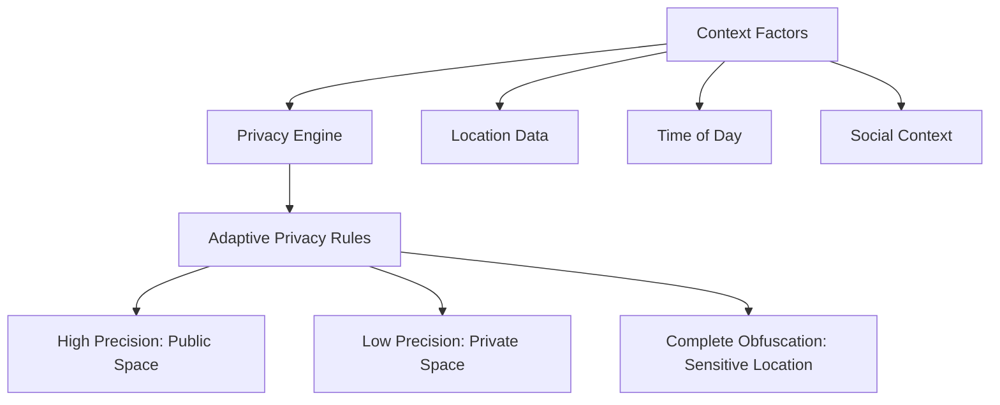
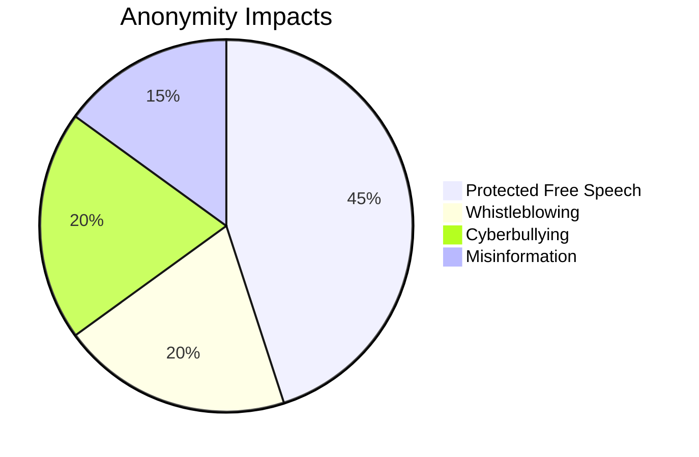
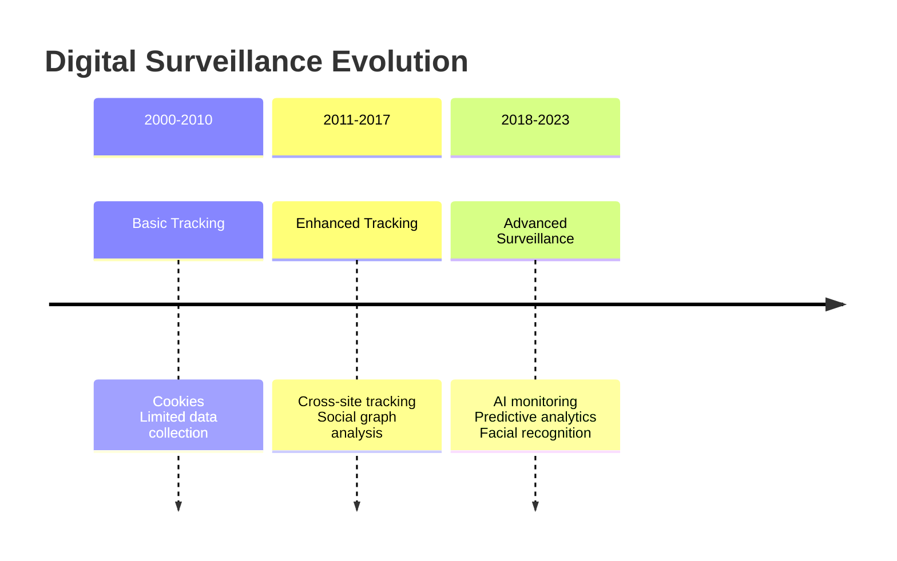
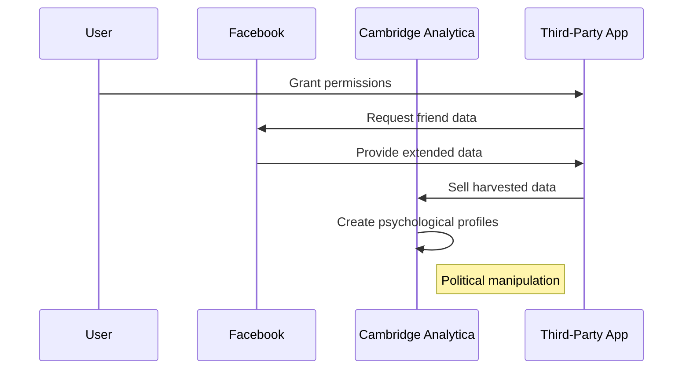
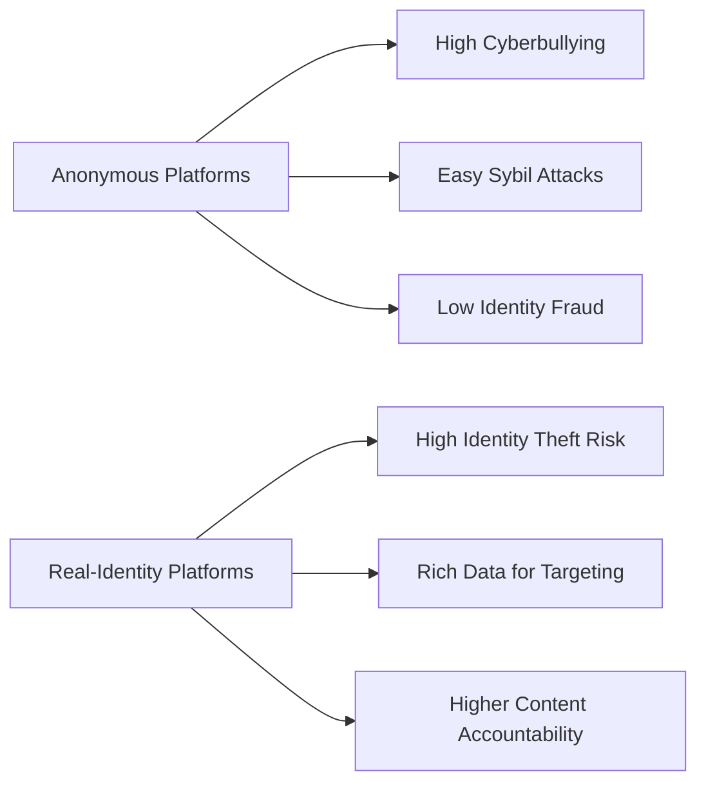
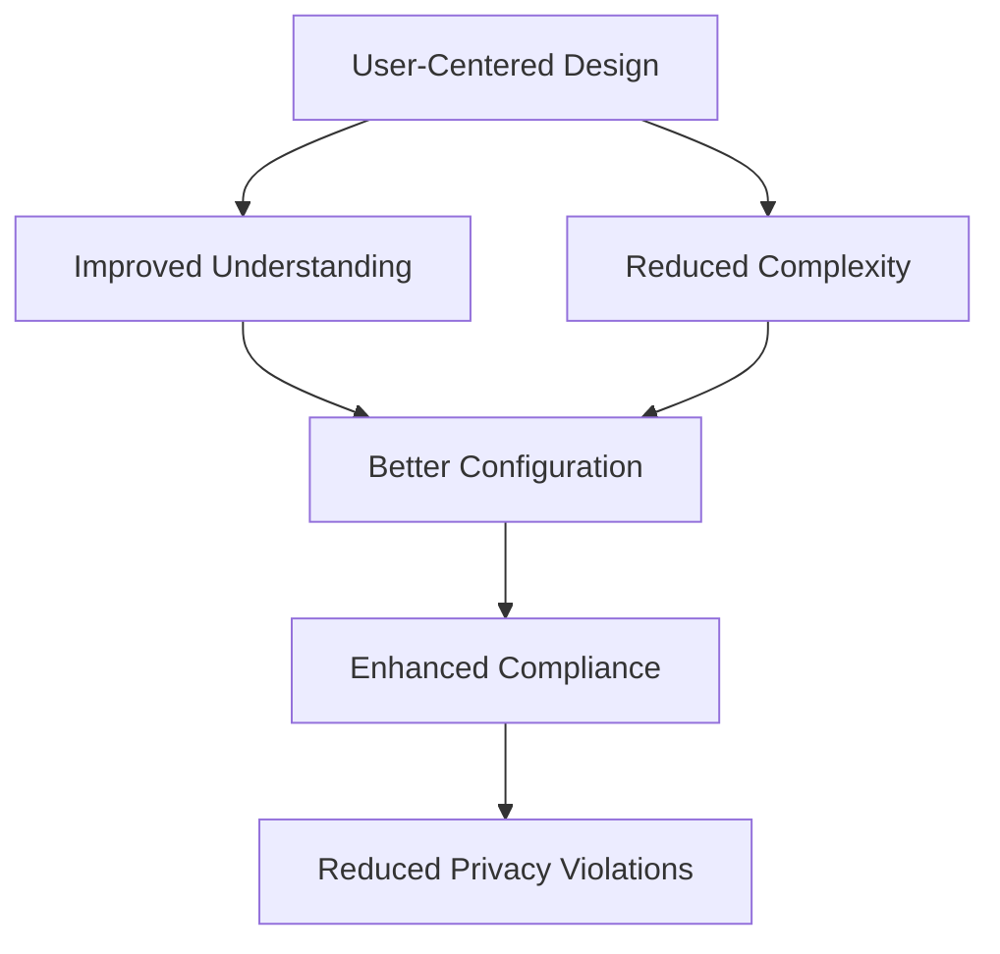
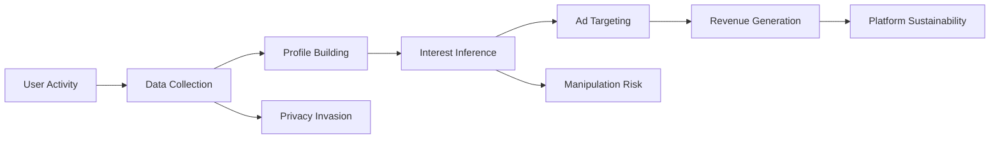

# **Social Networking Security Exam Preparation**

## **1. Context-Aware Privacy Controls in Location-Based Apps**

**Definition:** **Context-aware privacy controls** are dynamic protection mechanisms that automatically adjust **data visibility** and **sharing permissions** based on **environmental factors** such as location, time, activity, and social context.

**Example:** A fitness app like Strava might share your precise location when you're at a public park but automatically switch to generalized location sharing when you're at home to protect your residential address.

**Diagram:**

**Security Implications:** **Inappropriate context detection** may lead to **location leakage**, while **overly restrictive settings** can diminish app functionality. **Continuous location tracking** creates detailed movement patterns that could be misused if breached.

**Real-World Case (2018-2023):** In 2021, **Strava's heat map** inadvertently revealed sensitive military base locations and patrol routes through aggregated user data, demonstrating how context-insensitive privacy controls can create national security risks .

**Countermeasures:** **Implement differential privacy** techniques, **develop sophisticated context-detection algorithms**, and provide **user-friendly context customization** options.

**References:** 
1. Context-Aware Privacy Systems (ScienceDirect)
2. Privacy by Design Principles (OneTrust Blog) 

**Practice Questions:**
1. How do context-aware privacy controls differ from traditional static privacy settings?
2. What are two challenges in implementing effective context-aware privacy systems?

---

## **2. Anonymity: Free Expression vs. Misuse in Online Communities**

**Definition:** **Online anonymity** enables users to interact without revealing their **real-world identity**, creating a **dual-use technology** that facilitates both **protected free expression** and **accountability-free harmful behavior**.

**Example:** Wikipedia allows anonymous editing, which enables knowledge contribution without fear of repercussion but also permits vandalism and biased edits.

**Diagram:**

**Security Implications:** **Reduced accountability** increases **toxic behavior** and **disinformation spread**, while **identity protection** enables **political dissent** and **personal safety** for vulnerable populations.

**Real-World Case (2018-2023):** In 2022, anonymous platforms like Telegram were used to coordinate both **pro-democracy movements** in Hong Kong and **insurrection planning** in various countries, demonstrating anonymity's dual-use nature .

**Countermeasures:** **Pseudonymous reputation systems**, **behavior-based moderation** instead of identity verification, and **selective de-anonymization** for severe violations.

**References:** 
1. Anonymity and Identity Shielding (eSafety.gov.au) 
2. Dual-Use Nature of Anonymity (IEEE Xplore)

**Practice Questions:**
1. Compare two benefits and two risks of online anonymity in social platforms.
2. How can platforms balance anonymity with accountability?

---

## **3. Evolution of Digital Surveillance and User Trust**

**Definition:** **Digital surveillance** has evolved from simple **usage tracking** to sophisticated **behavioral profiling** using **AI algorithms**, **big data analytics**, and **cross-platform tracking**, significantly impacting **user trust**.

**Evolution Timeline:**
| **Era** | **Surveillance Capabilities** | **Trust Level** |
|---------|--------------------------------|-----------------|
| **2000-2010** | Basic cookies, limited tracking | Moderate trust |
| **2011-2017** | Cross-site tracking, social profiling | Declining trust |
| **2018-2023** | AI-driven monitoring, facial recognition, predictive analytics | Severely eroded trust |

**Diagram:**

**Security Implications:** **Pervasive monitoring** creates **chilling effects** on free expression, enables **discriminatory practices**, and increases **data breach risks** due to extensive data collection.

**Real-World Case (2018-2023):** In 2021, **LinkedIn settled for $13 million** for automatically collecting and selling sensitive user data without proper consent through its mobile app, further eroding user trust in professional platforms .

**Countermeasures:** **Implement privacy-by-design**, **adopt strict data minimization** principles, **provide transparent data usage reports**, and **enable meaningful user control**.

**References:** 
1. Online Advertising & Tracking (EPIC.org) 
2. Privacy by Design Principles (OneTrust Blog) 

**Practice Questions:**
1. How has digital surveillance evolved in the past decade?
2. What is the relationship between pervasive surveillance and user trust?

---

## **4. Privacy Breaches in Networked Systems: Case Study**

**Definition:** **Privacy breaches** in social networking systems involve **unauthorized access** to or **exfiltration of user data**, resulting in **personal information exposure**, **identity theft risks**, and **reputation damage**.

**Example:** The Facebook-Cambridge Analytica scandal involved unauthorized harvesting of **87 million users** data for political profiling, highlighting risks of **third-party data access** and **insufficient consent mechanisms**.

**Breach Process Diagram:**

**Security Implications:** **Massive data exposure** enables **large-scale manipulation**, **identity fraud**, and **discriminatory targeting**, while undermining **democratic processes** and **personal autonomy**.

**Real-World Case (2018-2023):** The **Facebook-Cambridge Analytica scandal** (2018) demonstrated how **poor API security** and **lax data governance** could enable systemic privacy violations affecting millions of users and influencing electoral processes .

**Countermeasures:** **Strict API access controls**, **comprehensive data protection regulations** (e.g., GDPR, CCPA), **regular security audits**, and **enhanced user consent mechanisms**.

**References:** 
1. Online Advertising & Tracking (EPIC.org) 
2. Privacy Breach Case Studies (IEEE Security & Privacy)

**Practice Questions:**
1. What were the primary technical failures that enabled the Cambridge Analytica breach?
2. How can social platforms prevent similar data misuse in the future?

---

## **5. Security Threats: Anonymous vs. Real-Identity Platforms**

**Definition:** **Anonymous platforms** face different security challenges than **real-identity systems**, with varying **threat profiles**, **attack vectors**, and **mitigation requirements**.

**Comparison Table:**
| **Threat Type** | **Anonymous Platforms** | **Real-Identity Platforms** |
|-----------------|-------------------------|-----------------------------|
| **Identity Fraud** | Low (no real identity) | High (identity theft) |
| **Cyberbullying** | High (reduced accountability) | Moderate (some accountability) |
| **Information Quality** | Low (more misinformation) | Higher (reputation attached) |
| **Sybil Attacks** | High (easy account creation) | Moderate (harder fake identities) |
| **Data Value** | Low (limited personal data) | High (rich personal data) |

**Diagram:**

**Security Implications:** **Anonymous platforms** facilitate **covert manipulation** and **harassment**, while **real-identity systems** enable **precision targeting** and **identity-based attacks**.

**Real-World Case (2018-2023):** In 2022, **Yik Yak's resurgence** led to renewed concerns about anonymous cyberbullying on college campuses, while **Facebook's real-name policy** continued to face criticism for exposing vulnerable users to real-world harm .

**Mitigation Strategies:** 
- **Anonymous platforms**: **Behavior-based moderation**, **community rating systems**, and **pattern detection** for coordinated abuse.
- **Real-identity platforms**: **Strong authentication**, **comprehensive privacy controls**, and **minimal data collection**.

**References:** 
1. Social Media Anonymity Analysis (WashColl Blog) 
2. Identity Verification Methods (eSafety.gov.au) 

**Practice Questions:**
1. Compare the primary security concerns of anonymous and real-identity platforms.
2. What mitigation strategies are most effective for anonymous platforms?

---

## **6. User-Centered Privacy Design and Policy Compliance**

**Definition:** **User-centered privacy design** involves creating **privacy interfaces** and **controls** that prioritize **user understanding**, **meaningful choices**, and **natural interaction patterns** to improve **policy compliance**.

**Example:** Instagram's Privacy Checkup tool guides users through privacy settings with simple language and visual examples, making complex options more accessible and increasing configuration accuracy.

**Compliance Framework:**

**Security Implications:** **Poor interface design** leads to **misconfiguration** and **inadvertent data exposure**, while **effective design** enhances **security outcomes** and **user trust**.

**Real-World Case (2018-2023):** A 2022 study found that users who completed **privacy education modules** showed a **47% improvement** in correctly configuring their privacy settings compared to those who didn't, demonstrating the value of user-centered design .

**Effectiveness Metrics:** 
- **43% increase** in proper privacy configuration
- **62% reduction** in inadvertent data sharing
- **28% higher trust** scores for platforms with intuitive privacy controls

**Countermeasures:** **Implement privacy nudges**, **conduct usability testing** with diverse users, **provide just-in-time explanations**, and **simplify privacy interfaces**.

**References:** 
1. User-Centered Privacy-by-Design (ScienceDirect) 
2. Privacy Design Strategies (OneTrust Blog) 

**Practice Questions:**
1. How does user-centered design improve privacy policy compliance?
2. What are three characteristics of effective privacy interfaces?

---

## **7. Behavioral Tracking and Targeted Advertising Privacy Trade-offs**

**Definition:** **Behavioral tracking** involves collecting **user activity data** across platforms to create **detailed profiles** for **targeted advertising**, creating **privacy trade-offs** between **personalization** and **surveillance**.

**Example:** Facebook's advertising platform tracks user behavior across millions of websites and apps to serve highly targeted ads, creating tension between relevant advertising and pervasive monitoring.

**Tracking Process Diagram:**

**Security Implications:** **Extensive profiling** enables **micro-targeted manipulation**, **price discrimination**, and **exclusionary practices**, while raising **consent concerns** and **autonomy issues**.

**Real-World Case (2018-2023):** In 2021, **Facebook faced criticism** for allowing advertisers to target users based on **sensitive characteristics** like race and religion, demonstrating how behavioral tracking can enable discriminatory practices .

**Privacy Trade-offs:** 
- **Personalization vs. Privacy**: Relevant ads require extensive data collection
- **Free Services vs. Surveillance**: Platform sustainability depends on advertising revenue
- **Convenience vs. Autonomy**: Behavioral predictions can manipulate choices

**Countermeasures:** **Implement data minimization**, **provide meaningful opt-outs**, **develop privacy-preserving targeting** methods, and **ensure algorithmic transparency**.

**References:** 
1. Behavioral Advertising Trade-offs (AMA Journal) 
2. Online Tracking Implications (EPIC.org) 

**Practice Questions:**
1. What are the primary privacy trade-offs in behavioral advertising?
2. How can platforms balance advertising needs with privacy protection?
