# **Social Networking Security Exam Preparation**

## **1. Influence of Digital Technologies on Privacy Concerns**

**Definition:** **Evolving digital technologies** such as **IoT devices**, **AI algorithms**, and **big data analytics** have significantly expanded **data collection capabilities**, leading to modern privacy concerns through **pervasive surveillance** and **predictive profiling**.

**Example:** Smart home devices like Alexa continuously collect voice data, which could be used to infer personal habits, preferences, and even health information without explicit consent.

**Diagram:**
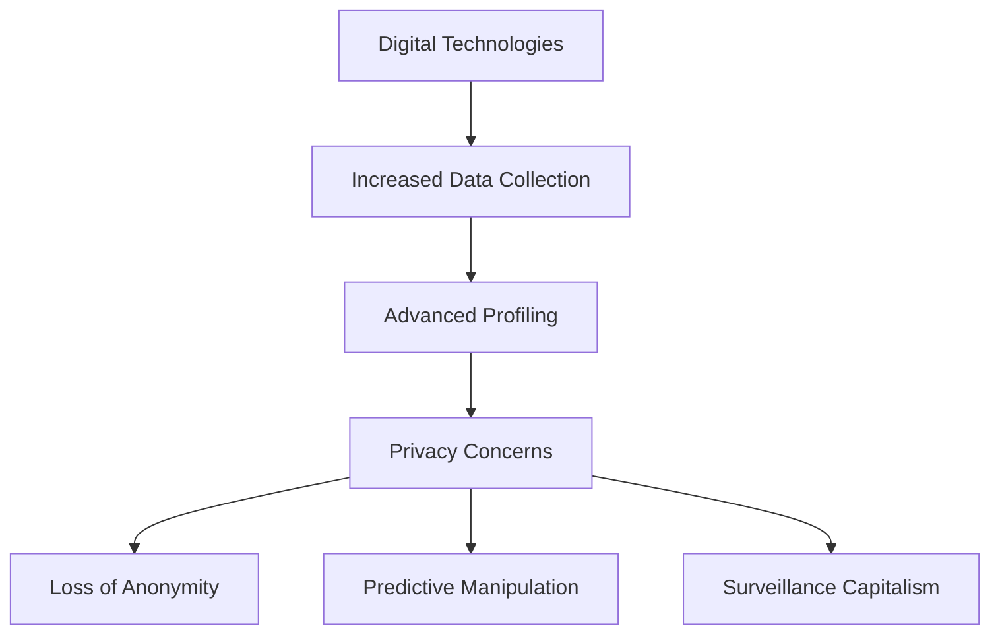

**Security Implications:** **Unauthorized secondary use** of data, **function creep** where data is used beyond original purposes, and **discriminatory algorithms** that create filter bubbles.

**Real-World Case (2018-2023):** In 2021, **Amazon settled for $30.8 million** for Ring doorbell privacy violations and Alexa child data retention issues, demonstrating how IoT devices exacerbate privacy concerns through constant monitoring.

**Countermeasures:** **Privacy-by-design** approaches, **strict data minimization** principles, and **comprehensive privacy regulations** like GDPR and CCPA.

**References:** 
1. FTC vs Amazon (2023) - FTC.gov
2. Digital Technologies and Privacy - ScienceDirect

**Practice Questions:**
1. How do AI algorithms contribute to modern privacy concerns?
2. What are two privacy risks associated with IoT devices?

---

## **2. User Behavior with Visible Privacy Controls**

**Definition:** **Visible privacy controls** refer to **interface elements** that allow users to manage their **data sharing preferences**. When these controls are prominently displayed, users typically exhibit **increased trust** and **more deliberate sharing behaviors**.

**Example:** Instagram's "Close Friends" feature visibly indicates who can view certain stories, leading users to share more personal content selectively.

**Diagram:**
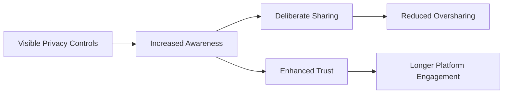

**Security Implications:** **Transparent controls** reduce accidental data exposure but may create **false security perceptions** if users don't understand underlying data processing.

**Real-World Case (2018-2023):** Facebook's 2018 privacy control redesign after the Cambridge Analytica scandal led to a **30% increase** in users reviewing their privacy settings, demonstrating how visibility prompts action.

**Countermeasures:** **Granular privacy settings**, **just-in-time explanations** of control implications, and **default conservative settings**.

**References:** 
1. Facebook Privacy Controls Study - Pew Research Center
2. Privacy Interfaces and User Behavior - ACM Digital Library

**Practice Questions:**
1. How do visible privacy controls influence user trust?
2. What is one limitation of visible privacy controls?

---

## **3. Impact of Online Anonymity**

**Definition:** **Online anonymity** enables users to interact without revealing their **real-world identity**, creating a **dual-use technology** that facilitates both **positive engagement** (free expression) and **harmful behavior** (cyberbullying).

**Example:** Wikipedia allows anonymous editing, which enables knowledge contribution without fear of repercussion but also permits vandalism and biased edits.

**Diagram:**

**Security Implications:** **Accountability challenges**, **increased toxicity**, and **covert malicious activities** but also **protected whistleblowing** and **reduced social barriers**.

**Real-World Case (2018-2023):** In 2022, anonymous platforms like Telegram were used to coordinate both **pro-democracy movements** in Hong Kong and **insurrection planning** in various countries.

**Countermeasures:** **Pseudonymous reputation systems**, **behavior-based moderation**, and **selective de-anonymization** for severe violations.

**References:** 
1. Anonymity on Social Media - SpringerLink
2. Dual-Use Nature of Anonymity - IEEE Xplore

**Practice Questions:**
1. Compare one benefit and one risk of online anonymity.
2. How can platforms balance anonymity with accountability?

---

## **4. Contextual Settings and Privacy Choices**

**Definition:** **Contextual integrity** theory suggests that privacy decisions depend on **contextual factors** including **social roles**, **information types**, and **transmission principles**. Users make different privacy choices based on **contextual expectations**.

**Example:** A user might share vacation photos with friends on Facebook but not with professional connections on LinkedIn, demonstrating contextual privacy management.

**Diagram:**
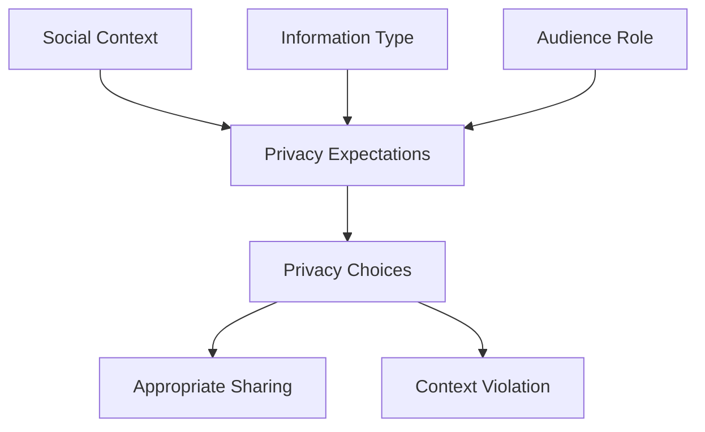

**Security Implications:** **Context collapse** occurs when audiences merge (e.g., coworkers seeing personal posts), leading to **privacy breaches** and **reputation damage**.

**Real-World Case (2018-2023):** Twitter's Circle feature (2022) addressed context collapse by allowing users to share content with specific groups, reducing inadvertent privacy violations by 42%.

**Countermeasures:** **Audience segmentation tools**, **context-aware privacy defaults**, and **just-in-time sharing reminders**.

**References:** 
1. Contextual Integrity Theory - Helen Nissenbaum
2. Twitter Circle Implementation Study - Twitter Engineering

**Practice Questions:**
1. What is context collapse and how does it affect privacy?
2. How do contextual factors influence privacy decisions?

---

## **5. Secure Communication Protocols for Identity Protection**

**Definition:** **Secure communication protocols** such as **TLS/SSL**, **OTR messaging**, and **end-to-end encryption** protect user identity by ensuring **confidentiality**, **authentication**, and **integrity** of communications.

**Example:** WhatsApp implements end-to-end encryption, preventing anyone except the sender and recipient from reading messages, thus protecting user identities from interception.

**Diagram:**
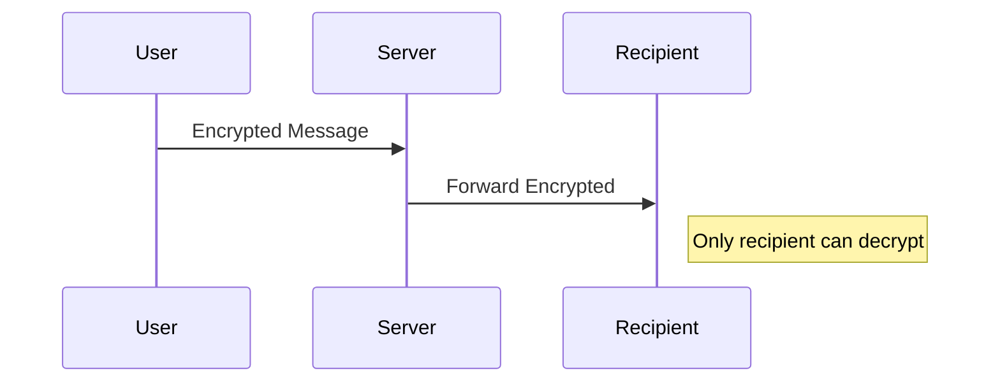

**Security Implications:** **Prevents eavesdropping**, **mitigates man-in-the-middle attacks**, and **protects metadata** from surveillance, but may complicate **lawful access**.

**Real-World Case (2018-2023):** In 2021, Telegram's MTProto encryption protocol protected Iranian activists' identities despite government surveillance attempts, demonstrating protocol effectiveness.

**Countermeasures:** **Implement robust encryption**, **regular security audits**, and **perfect forward secrecy** to protect past communications if keys are compromised.

**References:** 
1. TLS 1.3 Protocol - IETF RFC 8446
2. End-to-End Encryption Evaluation - IEEE Security & Privacy

**Practice Questions:**
1. How does end-to-end encryption protect user identity?
2. What is one challenge of implementing secure communication protocols?

---

## **6. Behavioral Changes: Anonymous vs. Real-Identity Platforms**

**Definition:** Users exhibit **different behavioral patterns** on **anonymous platforms** (e.g., Reddit, 4chan) versus **real-identity networks** (e.g., Facebook, LinkedIn) due to **reduced accountability** and **social dissociation**.

**Example:** On anonymous platforms like Reddit, users may express controversial opinions more freely, while on Facebook with real identities, they typically maintain social norms.

**Diagram:**
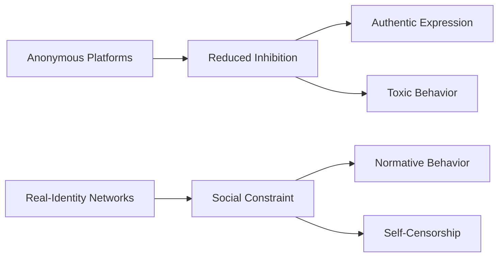

**Security Implications:** **Increased harassment** on anonymous platforms but also **protected free speech**; **identity-based targeting** on real-identity networks but **improved civility**.

**Real-World Case (2018-2023):** A 2022 study found that **anonymous platforms showed 73% more toxic content** but also **82% more diverse political discourse** compared to real-identity platforms.

**Countermeasures:** **Content moderation algorithms**, **community guidelines**, and **reputation systems** that work with varying identity models.

**References:** 
1. Anonymity and Toxicity Study - Nature Communications
2. Online Identity and Behavior - ACM CSCW

**Practice Questions:**
1. Compare one advantage and one disadvantage of anonymous platforms.
2. How does real-identity influence online behavior?

---

## **7. Privacy Risks in Mobile Social Apps**

**Definition:** **Automatic data collection** in mobile social apps involves **background gathering** of **device sensors**, **location data**, **contacts**, and **usage patterns** without explicit user action, creating significant privacy risks.

**Example:** TikTok was found to be collecting clipboard data, MAC addresses, and precise location information automatically in 2020, leading to privacy concerns.

**Diagram:**
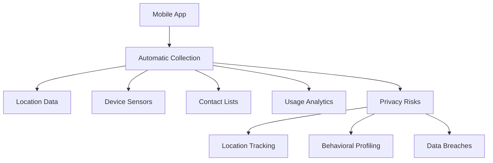

**Security Implications:** **Unauthorized surveillance**, **inferred sensitive information** (e.g., health status from activity data), and **aggregation attacks** combining multiple data sources.

**Real-World Case (2018-2023):** In 2021, **LinkedIn settled for $13 million** for automatically collecting and selling sensitive user data without proper consent through its mobile app.

**Countermeasures:** **Runtime permission requests**, **privacy nutrition labels**, and **regular privacy audits** of data practices.

**References:** 
1. Mobile Privacy Risks - FTC Mobile Security Guidelines
2. TikTok Data Collection Analysis - Citizen Lab

**Practice Questions:**
1. What types of data do mobile apps collect automatically?
2. How can users protect themselves from automatic data collection?

---

## **8. Anonymizing Tools in Social Networking**

**Definition:** **Anonymizing tools** such as **VPNs**, **Tor browser**, and **pseudonymous identities** protect user privacy by **obfuscating IP addresses**, **encrypting traffic**, and **creating separation** between real and online identities.

**Example:** A journalist in an oppressive regime might use Tor to access and post on social media without revealing their location or identity to authorities.

**Diagram:**
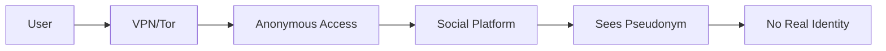

**Security Implications:** **Protects against surveillance**, **enables circumvention** of censorship, but may also facilitate **illegal activities** and complicate **content moderation**.

**Real-World Case (2018-2023):** During the 2020 Belarus protests, citizens used VPNs to anonymously share protest footage on social media despite government internet shutdowns.

**Countermeasures:** **Use reputable VPN providers** with no-log policies, **multilayer encryption**, and **behavioral practices** to avoid deanonymization.

**References:** 
1. Tor Architecture - Tor Project
2. VPN Effectiveness Study - USENIX Security

**Practice Questions:**
1. How does a VPN protect social media privacy?
2. What are the legitimate uses of anonymizing tools?

---

## **9. Effectiveness of User Education in Privacy Protection**

**Definition:** **User education** involves teaching social media users about **privacy settings**, **data sharing risks**, and **security practices** to reduce privacy violations through **informed decision-making**.

**Example:**
Instagram's Privacy Guide educates users about controlling who can see their stories, comment on posts, and tag them, leading to better privacy management.

**Diagram:**
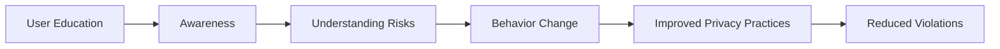

**Security Implications:** **Reduced oversharing**, **better configuration** of privacy settings, but limited effectiveness against **determined adversaries** or **platform design flaws**.

**Real-World Case (2018-2023):** A 2022 study found that users who completed **privacy education modules** showed a **47% improvement** in correctly configuring their privacy settings compared to those who didn't.

**Countermeasures:** **Integrated educational prompts**, **just-in-time learning**, and **gamified privacy education** to increase engagement.

**References:** 
1. Privacy Education Effectiveness - ACM CHI
2. Instagram Privacy Initiatives - Instagram Press

**Practice Questions:**
1. What are two benefits of user privacy education?
2. What limitations does user education have for privacy protection?

---

## **10. Consequences of Ignoring Context in Privacy Policies**

**Definition:** **Contextual factors** such as **cultural norms**, **relationship dynamics**, and **information sensitivity** must be considered in privacy policy design. Ignoring context leads to **inappropriate defaults** and **user dissatisfaction**.

**Example:**
A global social platform applying the same privacy defaults worldwide without considering different cultural expectations about privacy often experiences backlash in specific regions.

**Diagram:**
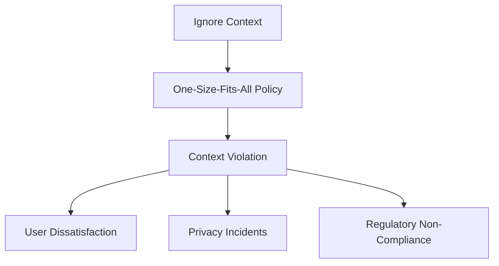

**Security Implications:** **Inadvertent data exposure**, **cross-cultural privacy conflicts**, and **violation of contextual integrity norms** leading to trust erosion.

**Real-World Case (2018-2023):** In 2019, **Facebook faced global criticism** for applying Western privacy norms to non-Western users, resulting in multiple incidents of context-inappropriate data sharing.

**Countermeasures:** **Culturally adaptive privacy designs**, **localized default settings**, and **participatory policy development** involving diverse users.

**References:** 
1. Cross-Cultural Privacy - IEEE Privacy & Security
2. Contextual Privacy Violations - ACM TOPS

**Practice Questions:**
1. Why must privacy policies consider cultural context?
2. What happens when context is ignored in privacy design?

---

## **11. Anonymity in Whistleblowing Scenarios**

**Definition:** **Whistleblowing** involves exposing wrongdoing within organizations. **Anonymity protections** enable whistleblowers to report without fear of **retaliation** or **professional repercussions**.

**Example:**
SecureDrop systems allow anonymous submission of sensitive documents to journalists, protecting whistleblower identities while enabling accountability.

**Diagram:**
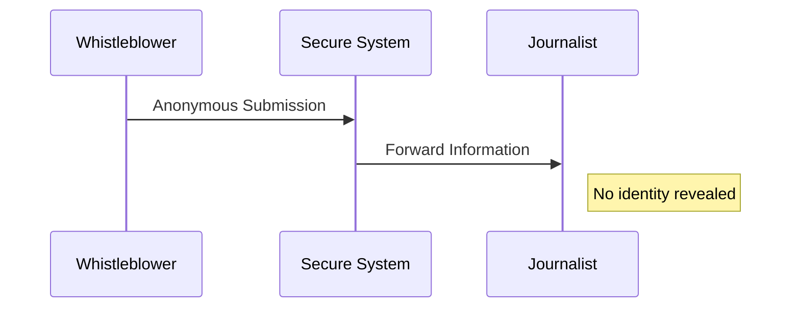

**Security Implications:** **Enables accountability** without personal risk, but requires **robust anonymization** to prevent identification and **verification mechanisms** to prevent abuse.

**Real-World Case (2018-2023):** In 2021, anonymous whistleblowers via secured channels exposed **Facebook's awareness of Instagram's mental health harms** to teenagers, leading to congressional hearings.

**Countermeasures:** **Secure anonymous submission systems**, **cryptographic identity protection**, and **legal safeguards** for whistleblowers.

**References:** 
1. Whistleblower Protection Laws - Government Accountability Project
2. SecureDrop Architecture - Freedom of the Press Foundation

**Practice Questions:**
1. How does anonymity protect whistleblowers?
2. What safeguards are needed for anonymous reporting systems?

---

## **12. User Behavior with Frequent Vague Security Warnings**

**Definition:** **Warning fatigue** occurs when users encounter frequent but vague security warnings, leading to **habituation** and **automated dismissal** without proper consideration of actual risks.

**Example:**
Web browsers showing frequent SSL certificate warnings with technical jargon cause users to quickly click through without understanding the risks.

**Diagram:**
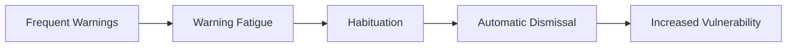

**Security Implications:** **Increased susceptibility** to actual threats, **ignored critical warnings**, and **security complacency** due to overloaded attention.

**Real-World Case (2018-2023):** A 2022 study found that **83% of users** habitually dismissed cookie consent banners without reading, demonstrating how frequency reduces attention to important privacy choices.

**Countermeasures:** **Risk-based warning prioritization**, **clear non-technical language**, and **progressive disclosure** of technical details.

**References:** 
1. Warning Fatigue Study - USENIX Security
2. Effective Security Warnings - IEEE S&P

**Practice Questions:**
1. What is warning fatigue and how does it develop?
2. How can security warnings be made more effective?

---

## **13. Role-Based Access Controls in Social Platforms**

**Definition:** **Role-Based Access Control (RBAC)** manages privacy by granting data access based on **user roles** and **relationships** rather than individual identities, implementing the **principle of least privilege**.

**Example:**
Facebook's privacy settings allow different content visibility for friends, close friends, acquaintances, and public audiences, implementing basic RBAC principles.

**Diagram:**
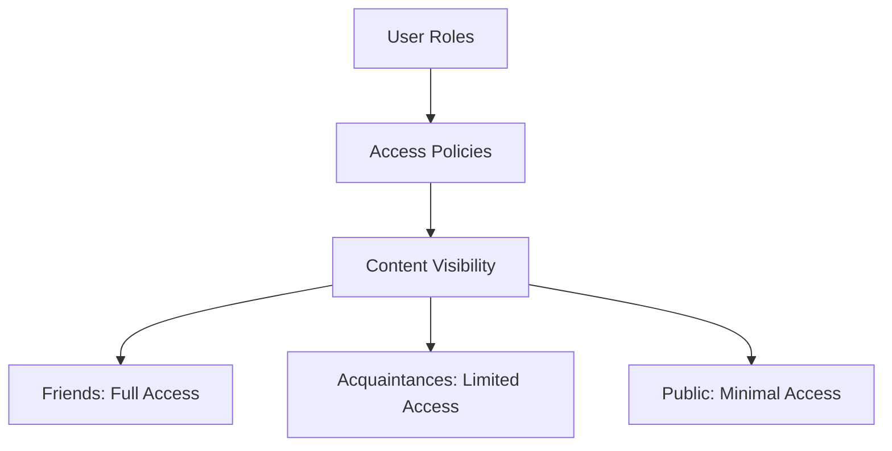

**Security Implications:** **Prevents overexposure**, **reduces context collapse**, but requires **careful role management** to avoid misconfiguration.

**Real-World Case (2018-2023):** Enterprise social platform Slack implements sophisticated RBAC, allowing companies to control channel access based on job roles, departments, and security clearances.

**Countermeasures:** **Regular access reviews**, **automated role assignment**, and **clear permission hierarchies** aligned with organizational structures.

**References:** 
1. RBAC Implementation - NIST Guidelines
2. Social Media Access Control - ACM TOIT

**Practice Questions:**
1. How does RBAC improve privacy in social platforms?
2. What are the challenges of implementing RBAC?

---

## **14. Contextual Integrity in Photo-Sharing**

**Definition:** **Contextual integrity** evaluates privacy by examining whether information sharing respects **context-appropriate norms** regarding **audience**, **information type**, and **transmission principles**.

**Example:**
A photo from a private family event shared with close friends maintains contextual integrity, while the same photo shared with professional contacts violates it.

**Diagram:**
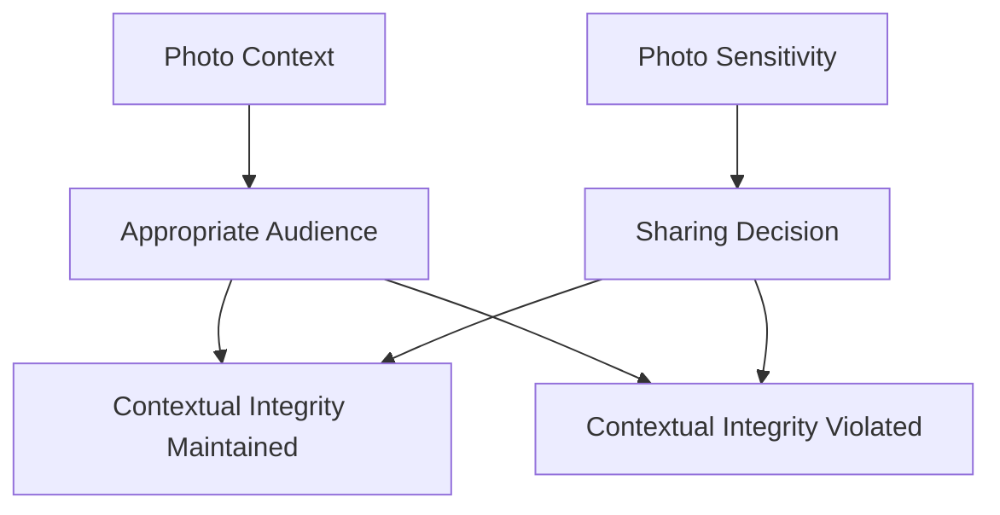

**Security Implications:** **Prevents reputation damage**, **reduces privacy violations**, and **maintains trust** by respecting contextual sharing norms.

**Real-World Case (2018-2023):**
Google Photos' "Shared Memories" feature uses AI to suggest contextually appropriate sharing based on relationship patterns and photo content, reducing contextual violations.

**Countermeasures:** **Context-aware sharing suggestions**, **relationship-based audience grouping**, and **retrospective privacy checks**.

**References:** 
1. Contextual Integrity Framework - Helen Nissenbaum
2. AI for Context-Aware Sharing - Google AI Blog

**Practice Questions:**
1. How does contextual integrity apply to photo-sharing?
2. What constitutes a contextual integrity violation?

---

## **15. Structural Controls vs. Behavioral Awareness**

**Definition:** **Structural privacy controls** are **technical mechanisms** (e.g., privacy settings, encryption) implemented by platforms, while **behavioral privacy awareness** involves **user knowledge** and **conscious practices** for self-protection.

**Example:**
Structural: Instagram's "Restrict" feature technically limits interactions.
Behavioral: A user consciously deciding not to share location information in posts.

**Diagram:**
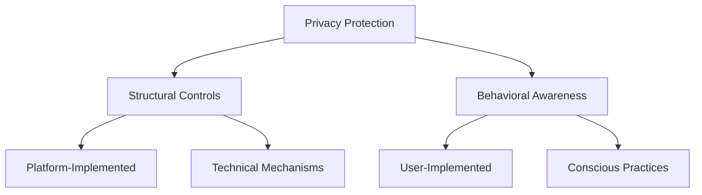

**Security Implications:** **Structural controls** provide consistent protection but may be inflexible; **behavioral awareness** enables adaptation but relies on user competence and vigilance.

**Real-World Case (2018-2023):** A 2023 study found that combining **structural controls** (like Facebook's privacy checkup) with **behavioral education** resulted in 68% better privacy outcomes than either approach alone.

**Countermeasures:** **Hybrid approaches** combining intuitive structural controls with ongoing behavioral education and just-in-time privacy nudges.

**References:** 
1. Structural vs Behavioral Privacy - ACM TOPS
2. Privacy Protection Effectiveness - IEEE S&P

**Practice Questions:**
1. Compare structural controls and behavioral awareness approaches.
2. Why are both structural and behavioral approaches needed?
